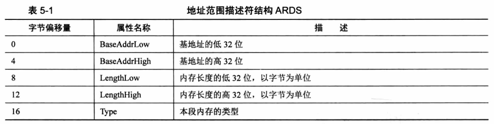
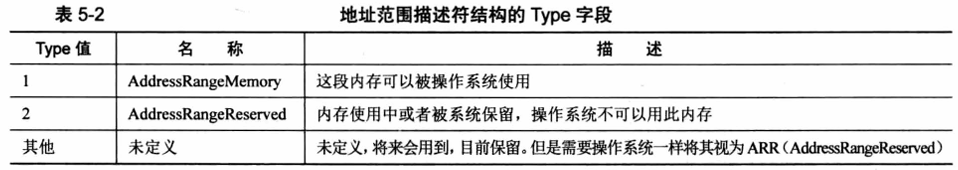
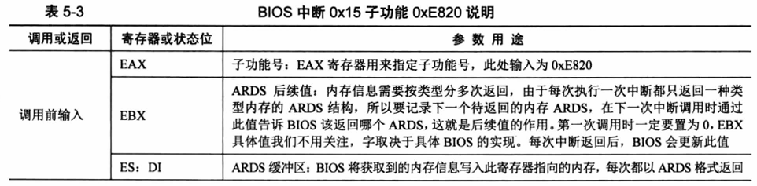
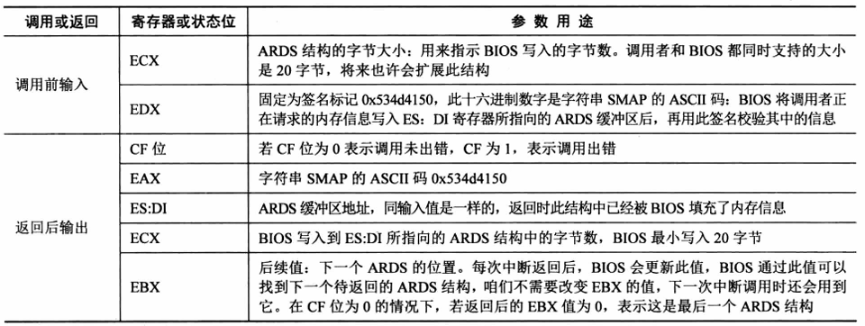
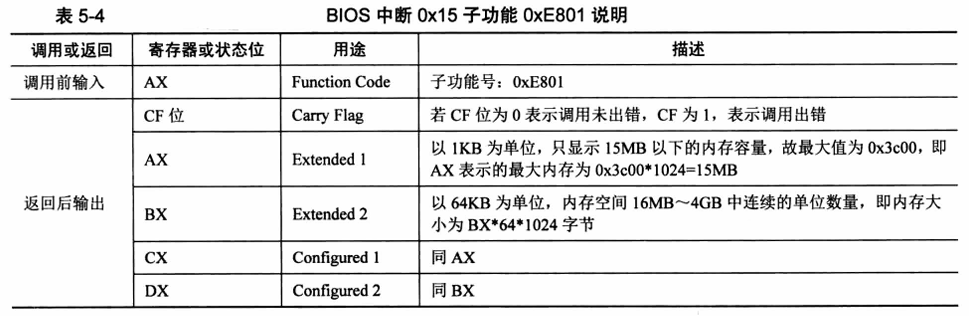
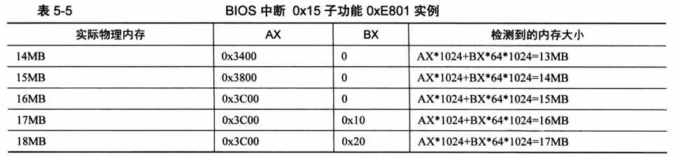
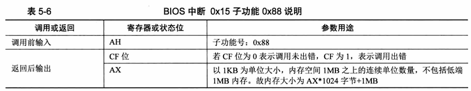
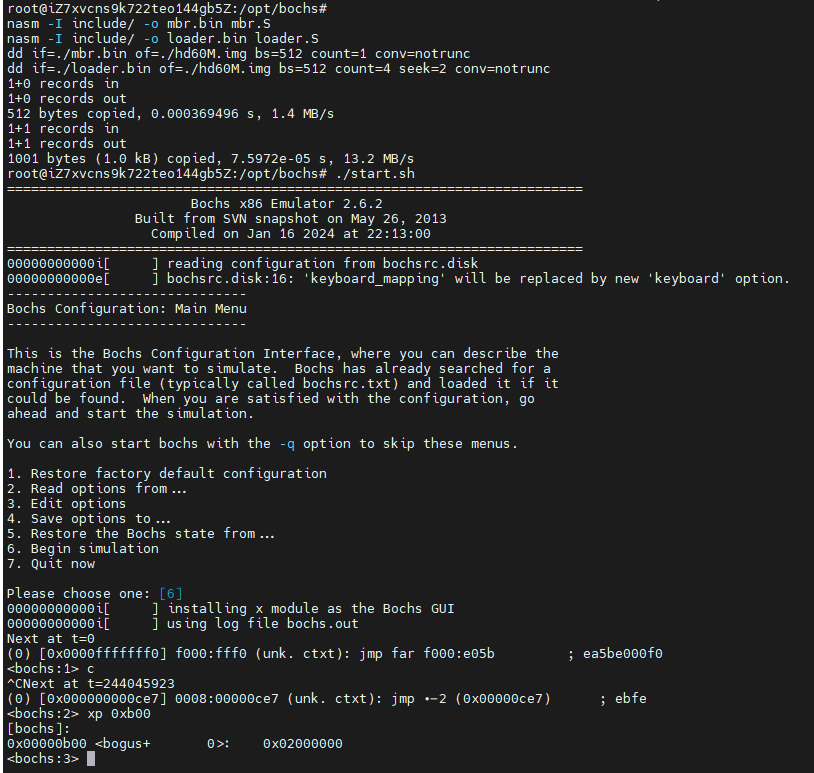

# 保护模式进阶，向内核迈进

## 获取物理内存容量

### linux获取内存的方式

linux有多重获取内存的方式，一种失败就尝试下一种

例如：linux内核2.6，通过`detect_memory`函数获取内存容量，本质是通过调用BIOS的`0x15`中断实现

BIOS`0x15`中断的3个子功能，子功能号存放在寄存器`EAX`或`AX`中：

1. `EAX=0xE820`：遍历主机上全部内存
2. `AX=0xE801`：分别检测低15MB和16MB~4G的内存，最大支持4G
3. `AH=0x88`：最多检测出64MB内存，超过该值，则位64MB

BIOS中断是实模式下的方法，只能在进入保护模式前调用

BIOS及其中断也是一组软件，访问硬件也依靠硬件的接口，获取内存信息，也依靠连续调用硬件的`应用程序接口`

BIOS调用是有代价的（比如需要将当前程序的上下文保护起来，以便返回），所以尽量在一次中断中获取足够的信息

### 利用BIOS中断`0x15`子功能`0xE820`获取内存

BIOS中断`0x15`子功能`0xE820`能够获取系统的内存布局，每次调用只返回一种类型的内存信息，直到返回所有信息

内存信息的内容使用地址范围描述符来描述的，用于存储这种描述符的结构称为，地址范围描述符（Address Range Descriptor Structure，ARDS）



每个字段4字节，共5个字段，此结构共20字节，每次`int 0x15`返回一个这样的结构，共20字节



为什么BIOS按类型返回内存信息？因为这段内存可能是：

1. 系统的ROM
2. ROM用到了这部分内存
3. 设备内存映射到了这部分内存
4. 由于某种原因，这段内存不适合标准设备使用

32位环境下，只会用到低32位属性

调用BIOS中断`0x15`的`0xE820`子功能需要哪些参数：





调用步骤如下：

1. 填写好调用前输入中列出的寄存器
2. 执行中断`int 0x15`
3. 在`CF`位为0时，返回后输出对应的寄存器便会有对应的结果

### 利用BIOS中断`0x15`子功能`0xE801`获取内存

此方法检测到的内存分别存在两组寄存器中

1. **低于15MB的内存以1KB为单位记录**，单位数量存于寄存器`AX`和`CX`，`AX`和`CX`值相同，`AX`和`CX`最大值为`0x3c00`，即`0x3c00*1024=15MB`
2. **16MB~4GB以64KB为单位记录**，单位数量存于寄存器`BX`和`DX`，`BX`和`DX`相同，`BX`和`DX`最大值为`0xff00=4GB/64/1024-16MB/64KB`，即`0xff00*64*1024=4GB`



疑问：

1. 为什么要分前15MB和16MB以上，来展示4GB内存
2. 为什么寄存器结果重复？`AX`和`CX`，`BX`和`DX`



原因：

历史遗留问题，80286有24位地址线，寻址空间是16MB，一些ISA设备需要使用15MB以上内存作为缓冲区，所以留出来了，为了兼容，操作系统不可用15MB~16MB这段1MB的内存，一般可通过BIOS开关

手册中提到，`AX`用途为“Extended 1”，`CX`用途为“Configured 1”，`AX`和`CX`为一组，`BX`和`DX`类同

调用步骤如下：

1. 将`AX`寄存器写入`0xE801`
2. 执行中断`int 0x15`
3. 在`CF`位为0时，返回后输出对应的寄存器便会有对应的结果

### 利用BIOS中断`0x15`子功能`0x88`获取内存

只会显示到63MB，因为不包括起始的1MB，所以在结果中要加上起始的1MB



调用步骤如下：

1. 将`AX`寄存器写入`0x88`
2. 执行中断`int 0x15`
3. 在`CF`位为0时，返回后输出对应的寄存器便会有对应的结果

### 实战内存容量检测

尝试上述三种内存检测方式，`loader.S`:

```S
%include "boot.inc"
section loader vstart=LOADER_BASE_ADDR
LOADER_STACK_TOP equ LOADER_BASE_ADDR      ;保护模式下loader的栈

;构建gdt及其内部描述符
GDT_BASE:   dd 0x0000_0000                  ;dd是double-word，双字，4字节，
            dd 0x0000_0000                  ;地址越来越高，第一个段描述符不可用，因此用0填充
CODE_DESC:  dd 0x0000_FFFF                                      ;代码段描述符，低4字节，FFFF是段界限，0000是段基址
            dd DESC_CODE_HIGH4                                  ;             高4字节
DATA_STACK_DESC:    dd 0x0000_FFFF                              ;数据段和栈段描述符
                    dd DESC_DATA_HIGH4
VIDEO_DESC: dd 0x8000_0007  ;段基址0x8000，颗粒度为4K，limit=(0xbffff-0xb8000)/4k=0x7，因此段界限位0x0007
                            ;显示段描述符，0xb8000~0xbffff是用于文本模式显示适配器的内存地址
                            ;内存地址0xc0000显示适配器BIOS所在区域
            dd DESC_VIDEO_HIGH4 ;此时dpl（特权级）为0
GDT_SIZE equ $ - GDT_BASE       ; equ，宏定义，不占位置
GDT_LIMIT equ GDT_SIZE - 1  ;GDT段界限
times 60 dq 0   ;预留60个描述符的空位，预留的60个段描述符位置，60*8字节
                ;(4+60)*8=512=0x200字节
                ;程序加载地址为0x900，0x900+0x200=0xb00，所以0xb00是total_mem_bytes的内存地址

SELECTOR_CODE equ (0x0001<<3) + TI_GDT + RPL0 ;相当于(CODE_DESC - GDT_BASE)/8 + TI_GDT + RPL0，代码段选择子
SELECTOR_DATA equ (0x0002<<3) + TI_GDT + RPL0 ;相当于(DATA_STACK_DESC - GDT_BASE)/8 + TI_GDT + RPL0，数据段选择子，栈段选择子
SELECTOR_VIDEO equ (0x0003<<3) + TI_GDT + RPL0 ;相当于(VIDEO_DESC - GDT_BASE)/8 + TI_GDT + RPL0，显示段选择子

; total_mem_bytes 用于保存内存容量，以字节为单位，此位置比较好记
; 当前偏移loader.bin文件头0x200字节
; loader.bin的加载地址是0x900
; 故total_mem_bytes内存中的地址为0xb00
; 将来在内核中会引用此地址
total_mem_bytes dd 0

;gdt的指针，前两字节是gdt界限，后四个字节是gdt起始地址，lgdt命令用的
gdt_ptr dw GDT_LIMIT
        dd GDT_BASE

;人工对齐：total_mem_bytes4+gdt_ptr6+ards_buf244+ards_nr2，共256字节，2^8=0x100
ards_buf times 244 db 0     ; 为什么选244字节，目的是使loader_start对齐，使其为0x300，凑个整数，没别的意思
                            ; 所以这里MBR的跳转需要跳转到 LOADER_BASE_ADDR + 0x300
ards_nr dw 0  ;用于记录ARDS结构体数量

loader_start:
    ; int 15h eax = 0000E820h, edx = 534D4150h ('SMAP') 获取内存布局
    xor ebx, ebx            ; 第一次调用，ebx值要为0，第一个ards
    mov edx, 0x534d4150     ; edx只赋值一次，循环体中不会改变
    mov di, ards_buf        ; ards结构缓冲区，ards要被写入的地方，es: di

.e820_mem_get_loop:         ; 循环获取每个ards内存范围描述结构
    mov eax, 0x0000e820     ; 执行 int 0x15后，eax值变成0x534d4150，所以每次执行int前，都要更新为子功能号
    mov ecx, 20             ; ADRS 结构大小为20字节
    int 0x15
    jc .e820_failed_so_try_e801 ;若cf位为1，则有错误发生，尝试0xe801
                            ; 此时cf位为0
    add di, cx              ; 增加20字节，下一个ADRS的位置
    inc word [ards_nr]      ; 记录ARDS数量，加一
    cmp ebx, 0              ; 若ebx为0，且cf为0，说明ards已经全部返回
                            ; 当前已是最后一个
                            ; CMP 的说明 https://stackoverflow.com/questions/45898438/understanding-cmp-instruction
                            ; cmp ax bx , same to sub ax bx, but not save result to ax
                            ; ax > bx, zf=0, cf=0
                            ; ax < bx, zf=0, cf=1
                            ; ax = bx, zf=1, cf=0
                            ; ZF CF的说明 https://www.ic.unicamp.br/~celio/mc404-2006/flags.html
                            ; JNZ的说明 https://www.philadelphia.edu.jo/academics/qhamarsheh/uploads/Lecture%2018%20Conditional%20Jumps%20Instructions.pdf
    jnz .e820_mem_get_loop  ; 如果 cf != 0，则跳转，也就是ebx不为0的时候，没有结束，再次读取内存

    ; 在所有ards结构中
    ; 找出(base_add_low + length_low)的最大值，即内存的容量
    ; (base_add_low + length_low)，见表5-1
    mov cx, [ards_nr]
    ; 遍历每一个ARGS结构体，循环次数为ards的个数
    mov ebx, ards_buf
    xor edx, edx            ; edx为最大内存容量，先清零
.find_max_mem_area:
    ; 无需判断type是否为1，最大的内存块一定是可被使用的
    mov eax, [ebx]         ; base_add_low
    add eax, [ebx+8]        ; length_low
    add ebx, 20             ; 下一块ards结构的地址
    cmp edx, eax            ; 和现存最大内存容量相比，哪个大
    ; 遍历，找出最大，edx寄存器始终是最大内存容量
    jge .next_ards
    mov edx, eax            ; edx 为总内存大小
.next_ards:
    loop .find_max_mem_area ; 下一个ards
    jmp .mem_get_ok


.e820_failed_so_try_e801:
    mov ax, 0xe801
    int 0x15
    jc .e801_failed_so_try88    ; e801失败就尝试0x88，cf为1时

    ; 1 先算出低15MB的内存
    ; ax和cx中是以KB为单位的内存数量，将其转换为以byte为单位
    mov cx, 0x400           ; cx和ax值一样，cx用作乘数，2^10
    mul cx                  ; dx, ax = mul ax, cx, https://stackoverflow.com/questions/40893026/mul-function-in-assembly
                            ; dx为高16位，ax为低16位
                            ; 以1KB为单位
    shl edx, 16             ; edx = edx * 2^16, https://www.aldeid.com/wiki/X86-assembly/Instructions/shl
                            ; edx * 2^16，是因为他是高16位
    and eax, 0x0000FFFF     ; 取低16位
    or edx, eax             ; 相加
    add edx, 0x100000       ; ax只是15MB，故加1MB
    mov esi, edx            ; 先把低15MB的内存容量存入esi寄存器备份

    ; 2 再将16MB以上的内存转为byte单位
    ; 寄存器bx和dx中以64KB为单位的内存数量
    xor eax, eax            ; eax清零
    mov ax, bx
    mov ecx, 0x10000        ; 64KB
    mul ecx                 ; 32位乘法，默认的被乘数是eax，积为64位
                            ; edx, eax= mul eax, ecx
                            ; edx 高32位
    add esi, eax            
    ; 此方法只能测4GB以内的内存，故32位eax足够了
    ; edx肯定为0
    mov edx, esi            ; edx为总内存大小
    jmp .mem_get_ok

.e801_failed_so_try88:
    mov ah, 0x88
    int 0x15
    jc .error_hlt
    and eax, 0x0000FFFF

    mov cx, 0x400
    mul cx                  ; ax的内存容量以byte为单位
    shl edx, 16             ; 把dx移到高16位
    or edx, eax             ; 把积的低16位组合到edx, 为32位的积
    add edx, 0x100000       ; 0x88只返回1MB以上的内存，所以加1MB
    
error_hlt:
    jmp $

.mem_get_ok:
    mov [total_mem_bytes], edx  ;将内存转为byte单位后存入total_mem_bytes处


; 重复的
; 进入保护模式
;1 打开A20
;2 加载GDT
;3 将cr0的pe位置1

    ; 打开A20
    in al, 0x92
    or al, 0000_0010B
    out 0x92, al

    ; 加载GDT
    lgdt [gdt_ptr]

    ; 将cr0的pe位置1
    mov eax, cr0
    or eax, 0x0000_0001
    mov cr0, eax

    jmp dword SELECTOR_CODE: p_mode_start   ;刷新流水线
                                            ;下面是32位代码，CPU会提前将当前和后面的指令放在流水线中
                                            ;32位代码按照16位译码会出错
                                            ;因此无条件跳转清空流水线

[bits 32]
p_mode_start:
    mov ax, SELECTOR_DATA           ;初始化各段寄存器
    mov ds, ax
    mov es, ax
    mov ss, ax
    mov esp, LOADER_STACK_TOP
    mov ax, SELECTOR_VIDEO
    mov gs, ax

    mov byte [gs:160], 'P'          ;往显存第80个字符位置写入'P'，保护模式写入

    jmp $
```

需要将MBR的`jmp`指令修改为

```S
jmp LOADER_BASE_ADDR + 0x300
```

因为`loader_start`之前有`0x300`大小的数据定义

目前还没打印出`total_mem_bytes`

所以用bochs调试查看，此时可以查看boch的配置`bochsrc.disk`，`megs: 32`为32MB

编译

```shell
nasm -I include/ -o mbr.bin mbr.S
nasm -I include/ -o loader.bin loader.S
dd if=./mbr.bin of=./hd60M.img bs=512 count=1 conv=notrunc
dd if=./loader.bin of=./hd60M.img bs=512 count=4 seek=2 conv=notrunc
```

