# 保护模式进阶，向内核迈进

## 获取物理内存容量

### linux获取内存的方式

linux有多重获取内存的方式，一种失败就尝试下一种

例如：linux内核2.6，通过`detect_memory`函数获取内存容量，本质是通过调用BIOS的`0x15`中断实现

BIOS`0x15`中断的3个子功能，子功能号存放在寄存器`EAX`或`AX`中：

1. `EAX=0xE820`：遍历主机上全部内存
2. `AX=0xE801`：分别检测低15MB和16MB~4G的内存，最大支持4G
3. `AH=0x88`：最多检测出64MB内存，超过该值，则位64MB

BIOS中断是实模式下的方法，只能在进入保护模式前调用

BIOS及其中断也是一组软件，访问硬件也依靠硬件的接口，获取内存信息，也依靠连续调用硬件的`应用程序接口`

BIOS调用是有代价的（比如需要将当前程序的上下文保护起来，以便返回），所以尽量在一次中断中获取足够的信息

### 利用BIOS中断`0x15`子功能`0xE820`获取内存

BIOS中断`0x15`子功能`0xE820`能够获取系统的内存布局，每次调用只返回一种类型的内存信息，直到返回所有信息

内存信息的内容使用地址范围描述符来描述的，用于存储这种描述符的结构称为，地址范围描述符（Address Range Descriptor Structure，ARDS）


每个字段4字节，共5个字段，此结构共20字节，每次`int 0x15`返回一个这样的结构，共20字节


为什么BIOS按类型返回内存信息？因为这段内存可能是：

1. 系统的ROM
2. ROM用到了这部分内存
3. 设备内存映射到了这部分内存
4. 由于某种原因，这段内存不适合标准设备使用

32位环境下，只会用到低32位属性

调用BIOS中断`0x15`的`0xE820`子功能需要哪些参数：


调用步骤如下：

1. 填写好调用前输入中列出的寄存器
2. 执行中断`int 0x15`
3. 在`CF`位为0时，返回后输出对应的寄存器便会有对应的结果

### 利用BIOS中断`0x15`子功能`0xE801`获取内存

此方法检测到的内存分别存在两组寄存器中

1. **低于15MB的内存以1KB为单位记录**，单位数量存于寄存器`AX`和`CX`，`AX`和`CX`值相同，`AX`和`CX`最大值为`0x3c00`，即`0x3c00*1024=15MB`
2. **16MB~4GB以64KB为单位记录**，单位数量存于寄存器`BX`和`DX`，`BX`和`DX`相同，`BX`和`DX`最大值为`0xff00=4GB/64/1024-16MB/64KB`，即`0xff00*64*1024=4GB`


疑问：

1. 为什么要分前15MB和16MB以上，来展示4GB内存
2. 为什么寄存器结果重复？`AX`和`CX`，`BX`和`DX`


原因：

历史遗留问题，80286有24位地址线，寻址空间是16MB，一些ISA设备需要使用15MB以上内存作为缓冲区，所以留出来了，为了兼容，操作系统不可用15MB~16MB这段1MB的内存，一般可通过BIOS开关

手册中提到，`AX`用途为“Extended 1”，`CX`用途为“Configured 1”，`AX`和`CX`为一组，`BX`和`DX`类同

调用步骤如下：

1. 将`AX`寄存器写入`0xE801`
2. 执行中断`int 0x15`
3. 在`CF`位为0时，返回后输出对应的寄存器便会有对应的结果

### 利用BIOS中断`0x15`子功能`0x88`获取内存

只会显示到63MB，因为不包括起始的1MB，所以在结果中要加上起始的1MB


调用步骤如下：

1. 将`AX`寄存器写入`0x88`
2. 执行中断`int 0x15`
3. 在`CF`位为0时，返回后输出对应的寄存器便会有对应的结果

### 实战内存容量检测

尝试上述三种内存检测方式，`loader.S`:

```S
%include "boot.inc"
section loader vstart=LOADER_BASE_ADDR
LOADER_STACK_TOP equ LOADER_BASE_ADDR      ;保护模式下loader的栈

;构建gdt及其内部描述符
GDT_BASE:   dd 0x0000_0000                  ;dd是double-word，双字，4字节，
            dd 0x0000_0000                  ;地址越来越高，第一个段描述符不可用，因此用0填充
CODE_DESC:  dd 0x0000_FFFF                                      ;代码段描述符，低4字节，FFFF是段界限，0000是段基址
            dd DESC_CODE_HIGH4                                  ;             高4字节
DATA_STACK_DESC:    dd 0x0000_FFFF                              ;数据段和栈段描述符
                    dd DESC_DATA_HIGH4
VIDEO_DESC: dd 0x8000_0007  ;段基址0x8000，颗粒度为4K，limit=(0xbffff-0xb8000)/4k=0x7，因此段界限位0x0007
                            ;显示段描述符，0xb8000~0xbffff是用于文本模式显示适配器的内存地址
                            ;内存地址0xc0000显示适配器BIOS所在区域
            dd DESC_VIDEO_HIGH4 ;此时dpl（特权级）为0
GDT_SIZE equ $ - GDT_BASE       ; equ，宏定义，不占位置
GDT_LIMIT equ GDT_SIZE - 1  ;GDT段界限
times 60 dq 0   ;预留60个描述符的空位，预留的60个段描述符位置，60*8字节
                ;(4+60)*8=512=0x200字节
                ;程序加载地址为0x900，0x900+0x200=0xb00，所以0xb00是total_mem_bytes的内存地址

SELECTOR_CODE equ (0x0001<<3) + TI_GDT + RPL0 ;相当于(CODE_DESC - GDT_BASE)/8 + TI_GDT + RPL0，代码段选择子
SELECTOR_DATA equ (0x0002<<3) + TI_GDT + RPL0 ;相当于(DATA_STACK_DESC - GDT_BASE)/8 + TI_GDT + RPL0，数据段选择子，栈段选择子
SELECTOR_VIDEO equ (0x0003<<3) + TI_GDT + RPL0 ;相当于(VIDEO_DESC - GDT_BASE)/8 + TI_GDT + RPL0，显示段选择子

; total_mem_bytes 用于保存内存容量，以字节为单位，此位置比较好记
; 当前偏移loader.bin文件头0x200字节
; loader.bin的加载地址是0x900
; 故total_mem_bytes内存中的地址为0xb00
; 将来在内核中会引用此地址
total_mem_bytes dd 0

;gdt的指针，前两字节是gdt界限，后四个字节是gdt起始地址，lgdt命令用的
gdt_ptr dw GDT_LIMIT
        dd GDT_BASE

;人工对齐：total_mem_bytes4+gdt_ptr6+ards_buf244+ards_nr2，共256字节，2^8=0x100
ards_buf times 244 db 0     ; 为什么选244字节，目的是使loader_start对齐，使其为0x300，凑个整数，没别的意思
                            ; 所以这里MBR的跳转需要跳转到 LOADER_BASE_ADDR + 0x300
ards_nr dw 0  ;用于记录ARDS结构体数量

loader_start:
    ; int 15h eax = 0000E820h, edx = 534D4150h ('SMAP') 获取内存布局
    xor ebx, ebx            ; 第一次调用，ebx值要为0，第一个ards
    mov edx, 0x534d4150     ; edx只赋值一次，循环体中不会改变
    mov di, ards_buf        ; ards结构缓冲区，ards要被写入的地方，es: di

.e820_mem_get_loop:         ; 循环获取每个ards内存范围描述结构
    mov eax, 0x0000e820     ; 执行 int 0x15后，eax值变成0x534d4150，所以每次执行int前，都要更新为子功能号
    mov ecx, 20             ; ADRS 结构大小为20字节
    int 0x15
    jc .e820_failed_so_try_e801 ;若cf位为1，则有错误发生，尝试0xe801
                            ; 此时cf位为0
    add di, cx              ; 增加20字节，下一个ADRS的位置
    inc word [ards_nr]      ; 记录ARDS数量，加一
    cmp ebx, 0              ; 若ebx为0，且cf为0，说明ards已经全部返回
                            ; 当前已是最后一个
                            ; CMP 的说明 https://stackoverflow.com/questions/45898438/understanding-cmp-instruction
                            ; cmp ax bx , same to sub ax bx, but not save result to ax
                            ; ax > bx, zf=0, cf=0
                            ; ax < bx, zf=0, cf=1
                            ; ax = bx, zf=1, cf=0
                            ; ZF CF的说明 https://www.ic.unicamp.br/~celio/mc404-2006/flags.html
                            ; JNZ的说明 https://www.philadelphia.edu.jo/academics/qhamarsheh/uploads/Lecture%2018%20Conditional%20Jumps%20Instructions.pdf
    jnz .e820_mem_get_loop  ; 如果 cf != 0，则跳转，也就是ebx不为0的时候，没有结束，再次读取内存

    ; 在所有ards结构中
    ; 找出(base_add_low + length_low)的最大值，即内存的容量
    ; (base_add_low + length_low)，见表5-1
    mov cx, [ards_nr]
    ; 遍历每一个ARGS结构体，循环次数为ards的个数
    mov ebx, ards_buf
    xor edx, edx            ; edx为最大内存容量，先清零
.find_max_mem_area:
    ; 无需判断type是否为1，最大的内存块一定是可被使用的
    mov eax, [ebx]         ; base_add_low
    add eax, [ebx+8]        ; length_low
    add ebx, 20             ; 下一块ards结构的地址
    cmp edx, eax            ; 和现存最大内存容量相比，哪个大
    ; 遍历，找出最大，edx寄存器始终是最大内存容量
    jge .next_ards
    mov edx, eax            ; edx 为总内存大小
.next_ards:
    loop .find_max_mem_area ; 下一个ards
    jmp .mem_get_ok


.e820_failed_so_try_e801:
    mov ax, 0xe801
    int 0x15
    jc .e801_failed_so_try88    ; e801失败就尝试0x88，cf为1时

    ; 1 先算出低15MB的内存
    ; ax和cx中是以KB为单位的内存数量，将其转换为以byte为单位
    mov cx, 0x400           ; cx和ax值一样，cx用作乘数，2^10
    mul cx                  ; dx, ax = mul ax, cx, https://stackoverflow.com/questions/40893026/mul-function-in-assembly
                            ; dx为高16位，ax为低16位
                            ; 以1KB为单位
    shl edx, 16             ; edx = edx * 2^16, https://www.aldeid.com/wiki/X86-assembly/Instructions/shl
                            ; edx * 2^16，是因为他是高16位
    and eax, 0x0000FFFF     ; 取低16位
    or edx, eax             ; 相加
    add edx, 0x100000       ; ax只是15MB，故加1MB
    mov esi, edx            ; 先把低15MB的内存容量存入esi寄存器备份

    ; 2 再将16MB以上的内存转为byte单位
    ; 寄存器bx和dx中以64KB为单位的内存数量
    xor eax, eax            ; eax清零
    mov ax, bx
    mov ecx, 0x10000        ; 64KB
    mul ecx                 ; 32位乘法，默认的被乘数是eax，积为64位
                            ; edx, eax= mul eax, ecx
                            ; edx 高32位
    add esi, eax            
    ; 此方法只能测4GB以内的内存，故32位eax足够了
    ; edx肯定为0
    mov edx, esi            ; edx为总内存大小
    jmp .mem_get_ok

.e801_failed_so_try88:
    mov ah, 0x88
    int 0x15
    jc .error_hlt
    and eax, 0x0000FFFF

    mov cx, 0x400
    mul cx                  ; ax的内存容量以byte为单位
    shl edx, 16             ; 把dx移到高16位
    or edx, eax             ; 把积的低16位组合到edx, 为32位的积
    add edx, 0x100000       ; 0x88只返回1MB以上的内存，所以加1MB
    
error_hlt:
    jmp $

.mem_get_ok:
    mov [total_mem_bytes], edx  ;将内存转为byte单位后存入total_mem_bytes处


; 重复的
; 进入保护模式
;1 打开A20
;2 加载GDT
;3 将cr0的pe位置1

    ; 打开A20
    in al, 0x92
    or al, 0000_0010B
    out 0x92, al

    ; 加载GDT
    lgdt [gdt_ptr]

    ; 将cr0的pe位置1
    mov eax, cr0
    or eax, 0x0000_0001
    mov cr0, eax

    jmp dword SELECTOR_CODE: p_mode_start   ;刷新流水线
                                            ;下面是32位代码，CPU会提前将当前和后面的指令放在流水线中
                                            ;32位代码按照16位译码会出错
                                            ;因此无条件跳转清空流水线

[bits 32]
p_mode_start:
    mov ax, SELECTOR_DATA           ;初始化各段寄存器
    mov ds, ax
    mov es, ax
    mov ss, ax
    mov esp, LOADER_STACK_TOP
    mov ax, SELECTOR_VIDEO
    mov gs, ax

    mov byte [gs:160], 'P'          ;往显存第80个字符位置写入'P'，保护模式写入

    jmp $
```

需要将MBR的`jmp`指令修改为

```S
jmp LOADER_BASE_ADDR + 0x300
```

因为`loader_start`之前有`0x300`大小的数据定义

目前还没打印出`total_mem_bytes`

所以用bochs调试查看，此时可以查看boch的配置`bochsrc.disk`，`megs: 32`为32MB

编译

```shell
nasm -I include/ -o mbr.bin mbr.S
nasm -I include/ -o loader.bin loader.S
dd if=./mbr.bin of=./hd60M.img bs=512 count=1 conv=notrunc
dd if=./loader.bin of=./hd60M.img bs=512 count=4 seek=2 conv=notrunc
```


结果为`0x0200_0000`，即`2^25`=`32MB`

## 启用内存分页机制，虚拟空间

### 为什么要分页

内存是连续的，内存随便将导致内存的利用不充分

CPU在引用一个段时，会查看段描述符

段描述符`P`位，表示内存在内存中存在

段描述符`A`位，表示最近访问过该段

CPU访问内存段，`P`位为0时，CPU将抛出`NP`（段不存在）异常，并转去执行中段描述符中`NP`异常对应的中断处理程序，该程序由操作系统提供，该程序需要将内存从外存载入内存，并将`P`位置1

中断函数结束后，CPU将重复检查`P`位，检查通过后，将段描述符`A`位置1

段描述符的`A`位由CPU置1，由操作系统置0，操作系统发现`A`为1，就会将其置0，就可以统计段的使用频率，从而在内存不足时，找出使用频率最低的段，并换出到硬盘，腾出内存空间

线性地址是连续的，物理地址可以不连续，为了充分利用内存，需要需要接触线性地址与物理地址的一一映射关系，需要通过某种映射关系，将线性地址映射到任意物理地址

CPU实现了这种映射功能，通过页表功能提供，页表的工作由硬件完成

### 一级页表

分页机制建立在分段机制

保护模式下，段寄存器的内容是选择子，选择子是为了找到段基址，段基址和段内偏移量相加即为绝对地址，即线性地址，该线性地址在分段机制下被CPU认为是物理地址，可以直接用。段基址和段内偏移地址相加求和工作有CPU的**段组件**自动完成

CPU不开分页，段组件输出线性地址，是物理地址

CPU开分页，段组件输出的线性地址，是虚拟地址，需要在页表中查找虚拟地址对应的物理地址，查询工作由段组件自动完成

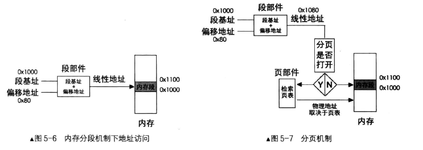

分页机制的作用：

1. 将虚拟地址转换为物理地址
2. 用大小相等的页代替大小不等的段

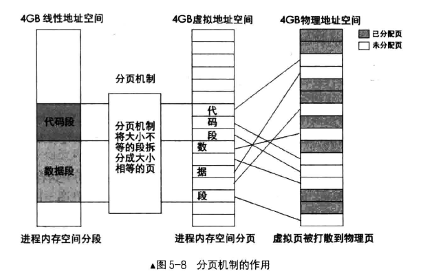

每个进程都有自己的4GB虚拟空间，操作系统按照进程中各段的起始范围，在进程的4GB虚拟空间中寻找可用空间分配内存段，此虚拟地址可以是页表，也可以是操作系统维护的某种数据结构，是逻辑删的，**没有真正写入物理内存**。

分页机制下，虚拟地址空间中的代码段和数据段在逻辑上被拆分成以页为单位的小内存块，然后操作系统为虚拟内存页分配真实的物理内存页，查找物理内存可用的页，并在页表登记这些物理页地址，所以，**每个进程都以为自己独享4GB的地址空间**

页表是一个N行1列的表格，页表的每一行称为页表项，每个页表项4字节，页表项存储了内存物理地址

页表与物理地址映射的原理

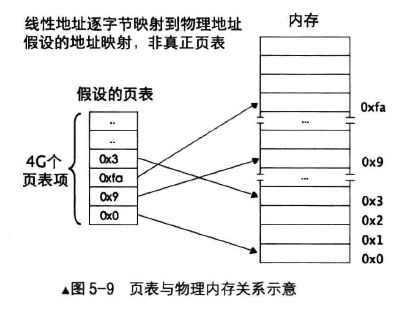

如果采用这种映射方式：

1. 表中会有4G个页表项
2. 32位地址用4字节的页表项来存储，页表总共4Byte*4G=16GB

显然上述方案不合理

将32位地址分成高低两部分，低地址部分是内存块大小，高地址是内存块数量，所以：内存块数*内存块大小=4GB

为节省页表空间，需要找到合适的内存块尺寸

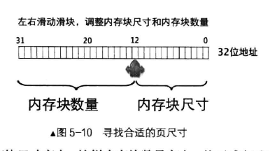

内存块数为2的20次方，内存块大小为2的12次方，即4KB，一个内存块称为一页，所以有4GB/4KB=1M个页

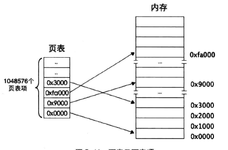

内存块数，即这20位，可以用来索引一个页

剩余12位，可以用作页内寻址

如何用线性地址在页表中找到对应的页表项呢？

1. 分页机制打开前，要将页表地址加载到控制寄存器`cr3`中，所以寄存器`cr3`中存储的是页表的物理地址，页表中存储的也是物理地址
2. 虚拟地址到物理地址的转换过程，相当于在关闭分页的机制下进行的，所涉及的页表和页表项的地址都会被CPU认为是物理地址，不会被分页机制重复转换

所以寻址过程：

线性地址的高20位作为页表项索引，每个页表项4字节，页表项索引*4为该**页表项的物理地址**字节偏移量，再加上`cr3`中的页表地址，即可找到映射后的物理页地址，用物理页地址与线性地址的低12位相加，得到的地址就是最终要访问的物理地址

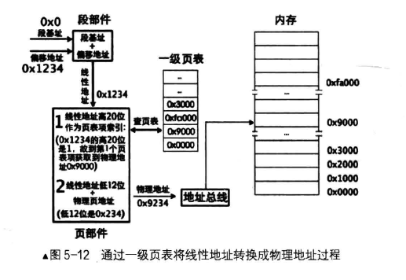

### 二级页表

为什么要有二级页表？

1. 一级页表最多容纳1M（2^20）个页表项，每个页表项4字节，所有页表项总共4MB
2. 一级页表的所有页表项需要提前建好，操作系统要占用4GB虚拟地址空间的高1GB，用户进程使用低3GB
3. 每个进程都有自己的页表，进程一多，就占空间

所以需要动态创建页表项

无论几级页表，标准页的尺寸都是4KB

一级页表将1M个标准页放置到一张页表中，二级页表将1M个标准页平均放置到1K个页表中，二级页表1K个页表项，每个页表项4字节，所以总共4KB，正好是一个标准页的大小

如何管理这么多个页表，有个页目录表来存储这些表的索引，每个页表的物理地址都在页目录表中以页目录项（Page Directory Entry，PDE）的形式存储

页目录表最多1024个页表，每个页目录项4K，所以页目录表也是4KB大小

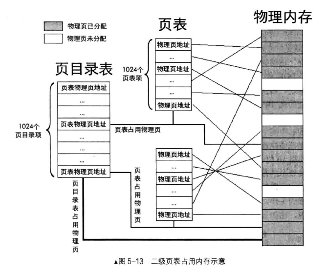

页目录表项数（1024）\* 页表项数（1024）* 2^12=2^32=4GB

任意一个32位物理地址，必然在某个页表内的某个物理页中

**定位一个物理页，首先要找到其所属页表，页目录中1024个页表，所以用10位表示，所以虚拟地址的高10位用来定位一个页表，虚拟地址的中间10位，定位具体的物理页，剩余12位可以表达4KB之内的任意地址，作为页内偏移量**

页目录项和页表项都是4字节，所以每项里的物理地址为：索引值*4+页表起始地址，页目录项和页表项都需要上述计算

上述计算过程，由页部件自动完成

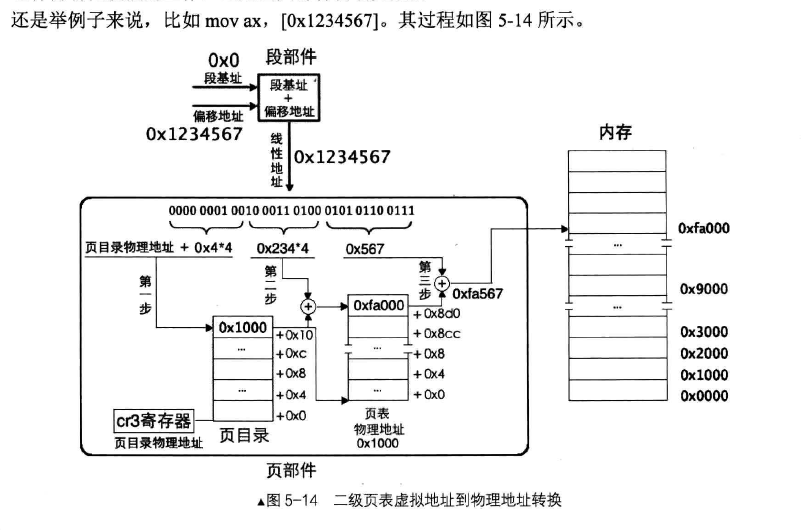

每个进程都有自己的页表

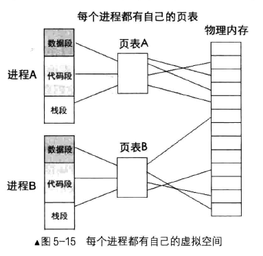

页目录项和页表项的结构

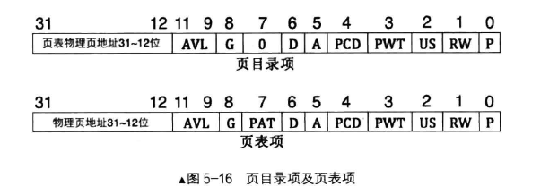

只有12~31位是物理地址，20位，每个页大小4KB，由偏移量决定了，所以剩下的12位可以作为属性使用

属性从低到高：

1. P：存在位，是否存在在物理内存中
2. RW：读写位，是否可写，都可读
3. US：普通用户超级用户位，1为用户级（0、1、2、3可访问），0为特权级（0、1、2可访问）
4. PWT：页级通写位，页级写透位，为1表示采用通写方式，表示该页不仅是普通内存还是高速缓存，与高速缓存有关
5. PCD：页级高速缓存禁止位，为1表示启动高速缓存
6. A：访问位，为1表示被CPU访问过了
7. D：脏页位，CPU对一个页面执行写操作时，会设置对应页表项D位为1，只对页表项有效，对页目录项无效
8. PAT，页属性表位，在页面一级的粒度上设置内存属性
9. G：全局位，为1表示这是全局页，如果是全局页，该页将在高速缓存`TLB`（Translation Lookaside Buffer）中一直保存，给出虚拟地址可以直接获取物理地址，无需转换，`TLB`空间小，只存放高频页面。清空`TLB`的方式有两种：用`invlpg`指令清空单独虚拟地址条目、重新加载`cr3`寄存器，将清空`TLB`
10. AVL，可用位，3位，操作系统可用该位

**启用分页机制，需要三步**：

1. 准备好页目录表及页表
2. 将页表地址写入控制寄存器`cr3`
3. 寄存器`cr0`的`PG`位置1（第31位）

`cr3`控制寄存器用于存储页表物理地址，所以又称页目录机制寄存器

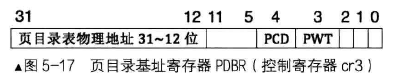

页目录表所在地址要求在一个自然页中，即页目录起始地址必须是4KB的整数倍，低12位全是0，所以`cr3`寄存器只写入物理地址的高20位，低12位中只有第3位的`PWT`位和`PCD`位有用，与高速缓存有关

因为控制寄存器可以和通用寄存器相互传值，所以可用`mov`指令赋值

`mov cr[0 ~ 7], r32`或`mov r32, cr[0 ~ 7]`

`CR0`的结构可在第4章的`保护模式的开关，CR0寄存器的PE位`找到

### 规划页表之操作系统与用户进程的关系

用户进程访问硬件相关资源时，需要让操作系统去做，操作系统将结果返回给用户进程

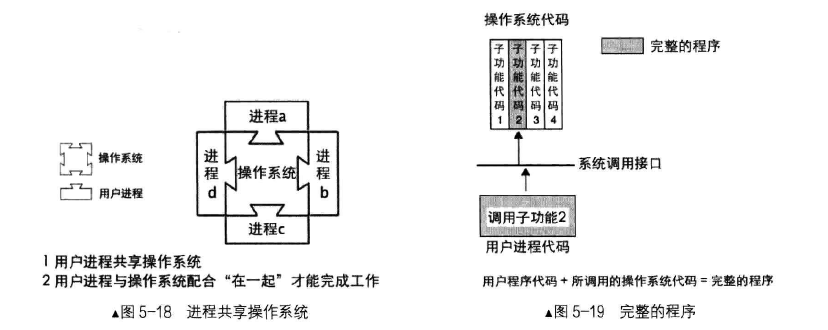

操作系统对于众多用户进程是共享的

所以用户进程4GB虚拟地址空间的高3GB以上的部分划分给操作系统，为了共享操作系统，保证所有用户进程的虚拟空间3GB~4GB的页表项中记录的物理页地址是相同的就行

综上，虚拟空间的0~3GB是用户进程的，3GB~4GB是操作系统的

### 启动分页机制

目录表位置放在0x100000，页目录本身4KB，所以第一个页表地址是0x101000

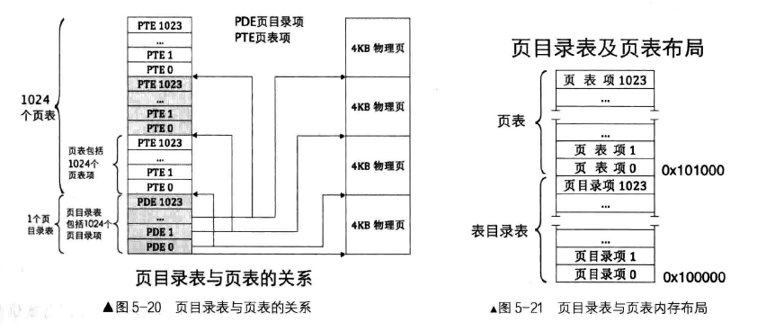

分页步骤也就是：

1. 创建页目录表
2. 创建页表
3. 初始化页目录表与页表数据
4. 将全局描述符中的视频段描述符存放于内核所在虚拟地址（4GB中的高1GB地址）
5. 将栈地址同样映射到内核所在虚拟地址
6. 页目录地址赋值给`cr3`
7. 打开`cr0`的`pg`位，开启分页
8. 重新加载`gdt`
9. 使用新显存地址打印字符

代码：

boot.inc，**新增页目录表物理地址声明和页表属性声明**

```S
; loader和kernel
LOADER_BASE_ADDR equ 0x900
LOADER_START_SECTOR equ 0x2

; 页目录表物理地址
PAGE_DIR_TABLE_POS equ 0x100000

; gdt描述符
DESC_G_4K equ 1_000_0000_0000_0000_0000_0000b   ;段描述符的G位，为4K粒度
DESC_D_32 equ 1_00_0000_0000_0000_0000_0000b    ;D/B位，表示32位操作数
DESC_L equ 0_0_0000_0000_0000_0000_0000b        ;64位代码标记，标记为0
DESC_AVL equ 0_0000_0000_0000_0000_0000b        ;留给操作系统用的，没有实际意义
DESC_LIMIT_CODE2 equ 1111_0000_0000_0000_0000b  ;代码段段界限的第2部分
DESC_LIMIT_DATA2 equ DESC_LIMIT_CODE2           ;数据段段界限的第2部分
DESC_LIMIT_VIDEO2 equ 0000_0000_0000_0000_0000b ;显示段段界限的第2部分
DESC_P equ 1000_0000_0000_0000b                 ;表示段存在
DESC_DPL_0 equ 00_0_0000_0000_0000b             ;表示该断描述符对应的内存段特权级为0
DESC_DPL_1 equ 01_0_0000_0000_0000b             ;表示该断描述符对应的内存段特权级为1
DESC_DPL_2 equ 10_0_0000_0000_0000b             ;表示该断描述符对应的内存段特权级为2
DESC_DPL_3 equ 11_0_0000_0000_0000b             ;表示该断描述符对应的内存段特权级为3
DESC_S_CODE equ 1_0000_0000_0000b               ;代码段的S段，为1表示为普通段，不是系统段
DESC_S_DATA equ DESC_S_CODE                     ;数据段的S段，为1表示为普通段，不是系统段
DESC_S_SYS equ 0_0000_0000_0000b                ;表示该段为系统段
DESC_TYPE_CODE equ 1000_0000_0000b              ;x=1,c=0,r=0,a=0 代码段可执行，非一致性，不可读，已访问位清零
DESC_TYPE_DATA equ 0010_0000_0000b              ;x=1,e=0,w=1,a=0 数据段不可执行，向上扩展，可写，已访问位清零
DESC_CODE_HIGH4 equ (0x00 << 24) + DESC_G_4K + DESC_D_32 + \
    DESC_L + DESC_AVL+ DESC_LIMIT_CODE2 + \
    DESC_P + DESC_DPL_0 + DESC_S_CODE + \
    DESC_TYPE_CODE + 0x00                       ;定义了代码段的高4字节，(0x00<<24)表示“段基址24-31”字段
DESC_DATA_HIGH4 equ (0x00 << 24) + DESC_G_4K + DESC_D_32 + \
    DESC_L + DESC_AVL+ DESC_LIMIT_DATA2 + \
    DESC_P + DESC_DPL_0 + DESC_S_DATA + \
    DESC_TYPE_DATA + 0x00                       ;定义了数据段的高4字节，(0x00<<24)表示“段基址24-31”字段
DESC_VIDEO_HIGH4 equ (0x00 << 24) + DESC_G_4K + DESC_D_32 + \
    DESC_L + DESC_AVL+ DESC_LIMIT_VIDEO2 + \
    DESC_P + DESC_DPL_0 + DESC_S_DATA + \
    DESC_TYPE_DATA + 0x0b                       ;定义了显示段的高4字节，(0x00<<24)表示“段基址24-31”字段，0x0b是段基址16-23位，文本模式的起始地址为0xb8000，因此段基址设置0xb8000

; 选择子属性
RPL0 equ 00b
RPL1 equ 01b
RPL2 equ 10b
RPL3 equ 11b
TI_GDT equ 000b
TI_LDT equ 100b

; 页表相关属性
PG_P equ 1b
PG_RW_R equ 00b
PG_RW_W equ 10b
PG_US_S equ 000b
PG_US_U equ 100b
```

loader.S，新增页表初始化过程以及分页开启

```S
%include "boot.inc"
section loader vstart=LOADER_BASE_ADDR
LOADER_STACK_TOP equ LOADER_BASE_ADDR      ;保护模式下loader的栈
                           ;也可以在MBR直接跳到loader_start的位置，该jmp就可以不要了

;构建gdt及其内部描述符
GDT_BASE:   dd 0x0000_0000                  ;dd是double-word，双字，4字节，
            dd 0x0000_0000                  ;地址越来越高，第一个段描述符不可用，因此用0填充
CODE_DESC:  dd 0x0000_FFFF                                      ;代码段描述符，低4字节，FFFF是段界限，0000是段基址
            dd DESC_CODE_HIGH4                                  ;             高4字节
DATA_STACK_DESC:    dd 0x0000_FFFF                              ;数据段和栈段描述符
                    dd DESC_DATA_HIGH4
VIDEO_DESC: dd 0x8000_0007  ;段基址0x8000，颗粒度为4K，limit=(0xbffff-0xb8000)/4k=0x7，因此段界限位0x0007
                            ;显示段描述符，0xb8000~0xbffff是用于文本模式显示适配器的内存地址
                            ;内存地址0xc0000显示适配器BIOS所在区域
            dd DESC_VIDEO_HIGH4 ;此时dpl（特权级）为0
GDT_SIZE equ $ - GDT_BASE       ; equ，宏定义，不占位置
GDT_LIMIT equ GDT_SIZE - 1  ;GDT段界限
times 60 dq 0   ;预留60个描述符的空位，预留的60个段描述符位置，60*8字节
                ;(4+60)*8=512=0x200字节
                ;程序加载地址为0x900，0x900+0x200=0xb00，所以0xb00是total_mem_bytes的内存地址


SELECTOR_CODE equ (0x0001<<3) + TI_GDT + RPL0 ;相当于(CODE_DESC - GDT_BASE)/8 + TI_GDT + RPL0，代码段选择子
SELECTOR_DATA equ (0x0002<<3) + TI_GDT + RPL0 ;相当于(DATA_STACK_DESC - GDT_BASE)/8 + TI_GDT + RPL0，数据段选择子，栈段选择子
SELECTOR_VIDEO equ (0x0003<<3) + TI_GDT + RPL0 ;相当于(VIDEO_DESC - GDT_BASE)/8 + TI_GDT + RPL0，显示段选择子

; total_mem_bytes 用于保存内存容量，以字节为单位，此位置比较好记
; 当前偏移loader.bin文件头0x200字节
; loader.bin的加载地址是0x900
; 故total_mem_bytes内存中的地址为0xb00
; 将来在内核中会引用此地址
total_mem_bytes dd 0


;gdt的指针，前两字节是gdt界限，后四个字节是gdt起始地址，lgdt命令用的
gdt_ptr dw GDT_LIMIT
        dd GDT_BASE

;人工对齐：total_mem_bytes4+gdt_ptr6+ards_buf244+ards_nr2，共256字节，2^8=0x100
ards_buf times 244 db 0     ; 为什么选244字节，目的是使loader_start对齐，使其为0x300，凑个整数，没别的意思
                            ; 所以这里MBR的跳转需要跳转到 LOADER_BASE_ADDR + 0x300
ards_nr dw 0  ;用于记录ARDS结构体数量

loader_start:
    ; int 15h eax = 0000E820h, edx = 534D4150h ('SMAP') 获取内存布局
    xor ebx, ebx            ; 第一次调用，ebx值要为0，第一个ards
    mov edx, 0x534d4150     ; edx只赋值一次，循环体中不会改变
    mov di, ards_buf        ; ards结构缓冲区，ards要被写入的地方，es: di

.e820_mem_get_loop:         ; 循环获取每个ards内存范围描述结构
    mov eax, 0x0000e820     ; 执行 int 0x15后，eax值变成0x534d4150，所以每次执行int前，都要更新为子功能号
    mov ecx, 20             ; ADRS 结构大小为20字节
    int 0x15
    jc .e820_failed_so_try_e801 ;若cf位为1，则有错误发生，尝试0xe801
                            ; 此时cf位为0
    add di, cx              ; 增加20字节，下一个ADRS的位置
    inc word [ards_nr]      ; 记录ARDS数量，加一
    cmp ebx, 0              ; 若ebx为0，且cf为0，说明ards已经全部返回
                            ; 当前已是最后一个
                            ; CMP 的说明 https://stackoverflow.com/questions/45898438/understanding-cmp-instruction
                            ; cmp ax bx , same to sub ax bx, but not save result to ax
                            ; ax > bx, zf=0, cf=0
                            ; ax < bx, zf=0, cf=1
                            ; ax = bx, zf=1, cf=0
                            ; ZF CF的说明 https://www.ic.unicamp.br/~celio/mc404-2006/flags.html
                            ; JNZ的说明 https://www.philadelphia.edu.jo/academics/qhamarsheh/uploads/Lecture%2018%20Conditional%20Jumps%20Instructions.pdf
    jnz .e820_mem_get_loop  ; 如果 cf != 0，则跳转，也就是ebx不为0的时候，没有结束，再次读取内存

    ; 在所有ards结构中
    ; 找出(base_add_low + length_low)的最大值，即内存的容量
    ; (base_add_low + length_low)，见表5-1
    mov cx, [ards_nr]
    ; 遍历每一个ARGS结构体，循环次数为ards的个数
    mov ebx, ards_buf
    xor edx, edx            ; edx为最大内存容量，先清零
.find_max_mem_area:
    ; 无需判断type是否为1，最大的内存块一定是可被使用的
    mov eax, [ebx]         ; base_add_low
    add eax, [ebx+8]        ; length_low
    add ebx, 20             ; 下一块ards结构的地址
    cmp edx, eax            ; 和现存最大内存容量相比，哪个大
    ; 遍历，找出最大，edx寄存器始终是最大内存容量
    jge .next_ards
    mov edx, eax            ; edx 为总内存大小
.next_ards:
    loop .find_max_mem_area ; 下一个ards
    jmp .mem_get_ok


.e820_failed_so_try_e801:
    mov ax, 0xe801
    int 0x15
    jc .e801_failed_so_try88    ; e801失败就尝试0x88，cf为1时

    ; 1 先算出低15MB的内存
    ; ax和cx中是以KB为单位的内存数量，将其转换为以byte为单位
    mov cx, 0x400           ; cx和ax值一样，cx用作乘数，2^10
    mul cx                  ; dx, ax = mul ax, cx, https://stackoverflow.com/questions/40893026/mul-function-in-assembly
                            ; dx为高16位，ax为低16位
                            ; 以1KB为单位
    shl edx, 16             ; edx = edx * 2^16, https://www.aldeid.com/wiki/X86-assembly/Instructions/shl
                            ; edx * 2^16，是因为他是高16位
    and eax, 0x0000FFFF     ; 取低16位
    or edx, eax             ; 相加
    add edx, 0x100000       ; ax只是15MB，故加1MB
    mov esi, edx            ; 先把低15MB的内存容量存入esi寄存器备份

    ; 2 再将16MB以上的内存转为byte单位
    ; 寄存器bx和dx中以64KB为单位的内存数量
    xor eax, eax            ; eax清零
    mov ax, bx
    mov ecx, 0x10000        ; 64KB
    mul ecx                 ; 32位乘法，默认的被乘数是eax，积为64位
                            ; edx, eax= mul eax, ecx
                            ; edx 高32位
    add esi, eax
    ; 此方法只能测4GB以内的内存，故32位eax足够了
    ; edx肯定为0
    mov edx, esi            ; edx为总内存大小
    jmp .mem_get_ok

.e801_failed_so_try88:
    mov ah, 0x88
    int 0x15
    jc .error_hlt
    and eax, 0x0000FFFF

    mov cx, 0x400
    mul cx                  ; ax的内存容量以byte为单位
    shl edx, 16             ; 把dx移到高16位
    or edx, eax             ; 把积的低16位组合到edx, 为32位的积
    add edx, 0x100000       ; 0x88只返回1MB以上的内存，所以加1MB

.error_hlt:
    jmp $

.mem_get_ok:
    mov [total_mem_bytes], edx  ;将内存转为byte单位后存入total_mem_bytes处


; 进入保护模式
;1 打开A20
;2 加载GDT
;3 将cr0的pe位置1

    ; 打开A20
    in al, 0x92
    or al, 0000_0010B
    out 0x92, al

    ; 加载GDT
    lgdt [gdt_ptr]

    ; 将cr0的pe位置1
    mov eax, cr0
    or eax, 0x0000_0001
    mov cr0, eax

    jmp dword SELECTOR_CODE: p_mode_start   ;刷新流水线
                                            ;下面是32位代码，CPU会提前将当前和后面的指令放在流水线中
                                            ;32位代码按照16位译码会出错
                                            ;因此无条件跳转清空流水线
[bits 32]
p_mode_start:
    mov ax, SELECTOR_DATA           ;初始化各段寄存器
    mov ds, ax
    mov es, ax
    mov ss, ax
    mov esp, LOADER_STACK_TOP
    mov ax, SELECTOR_VIDEO
    mov gs, ax

;    mov byte [gs:160], 'P'          ;往显存第80个字符位置写入'P'，保护模式写入
;
;    jmp $

    call setup_page ; 初始化页目录表和页表

    sgdt [gdt_ptr]  ; 将gdt地址读入内存，一会用新地址加载gdt

    mov ebx, [gdt_ptr + 2]    ; gdt中视频段描述符地址+0xc0000000，gdt 2字节长度限制+4字节gdt地址基  址，+2就是gdt地址
    or dword [ebx + 0x18 + 4], 0xc0000000   ; 视频段是第三个描述符，每个描述符8字节，所以加24字节， 即0x18
                                            ; 段描述符高4字节为段基址的31~24位
    add dword [gdt_ptr + 2], 0xc0000000     ; gdt基址加上0xc0000000，使其也成为内核所在的高地址
    add esp, 0xc0000000                     ; 栈指针也映射到内核地址

    ; 页目录地址赋给cr3
    mov eax, PAGE_DIR_TABLE_POS
    mov cr3, eax

    ; 打开cr0的PG位，第31位
    mov eax, cr0
    or eax, 0x80000000
    mov cr0, eax

    ; 开启分页后，用新地址加载gdt
    lgdt [gdt_ptr]

    mov byte [gs:160], 'V'

    jmp $

; 创建页目录表和页表
setup_page:
    ; 清空页目录表内容
    mov ecx, 4096
    mov esi, 0
.clear_page_dir:
    mov byte [PAGE_DIR_TABLE_POS + esi], 0
    inc esi
    loop .clear_page_dir

    ; 创建页目录项（PDE）
.create_pde:
    mov eax, PAGE_DIR_TABLE_POS
    add eax, 0x1000 ; 第一个页表的位置，一个页表4KB=2^12
    mov ebx, eax    ; ebx作为基址

    ; 页目录项第0和第0xc00都存为第一个页表的地址，每个页表表示4MB内存
    ; 0xc03fffff以下的4MB地址和0x003fffff以下的4MB地址都指向相同的页表，第一个页表
    or eax, PG_US_U | PG_RW_W | PG_P    ; 页表属性：US为1，所有特权级都可访问，RW为1，可读写，P为1，存在于内存
    mov [PAGE_DIR_TABLE_POS + 0x0], eax ; 第1个页目录项，写入地址0x101000和属性111b，每项4字节
    mov [PAGE_DIR_TABLE_POS + 0xc00], eax   ; 第768个目录项，同样的数据，第768个页表项及以后的页表项都是内核的，0xc00=768*4
    ; 0x0~0xbfffffff，共计3G都属于用户进程
    ; 0xc0000000~0xffffffff，共计1G都属于内核
    sub eax, 0x1000
    mov [PAGE_DIR_TABLE_POS + 4092], eax    ; 最后一个页目录项指向页目录表的物理地址，每个页表4KB=4*1024=4096，最后一个页表项就是页目录表地址+4092|0x1000-4

    ; 创建页表项
    mov ecx, 256    ; 1M低端内存 / 每页大小4K = 256
    mov esi, 0
    mov edx, PG_US_U | PG_RW_W | PG_P
.create_pte:
    mov [ebx+esi*4], edx    ; ebx=0x101000，第一个页表物理地址，edx=0x00000007，第一个页表指向页目录项，第二个页表指向第一个页表地址
    add edx, 4096           ; 4096=2^12=0x1000，也就是物理页31到12位加1，也就是下一个页表的物理地址
    inc esi
    loop .create_pte

    mov eax, PAGE_DIR_TABLE_POS
    add eax, 0x2000                     ; 0x102000，第二个页目录项
    or eax, PG_US_S | PG_RW_W | PG_P
    mov ebx, PAGE_DIR_TABLE_POS
    mov ecx, 254            ; 第769~1022的所有目录项
    mov esi, 769
.create_kernel_pde:
    mov [ebx+esi*4], eax    ; 与
    inc esi
    add eax, 0x1000
    loop .create_kernel_pde
    ret
```

编译

```shell
nasm -I include/ -o mbr.bin mbr.S
nasm -I include/ -o loader.bin loader.S
dd if=./mbr.bin of=./hd60M.img bs=512 count=1 conv=notrunc
dd if=./loader.bin of=./hd60M.img bs=512 count=4 seek=2 conv=notrunc
```

运行查看结果

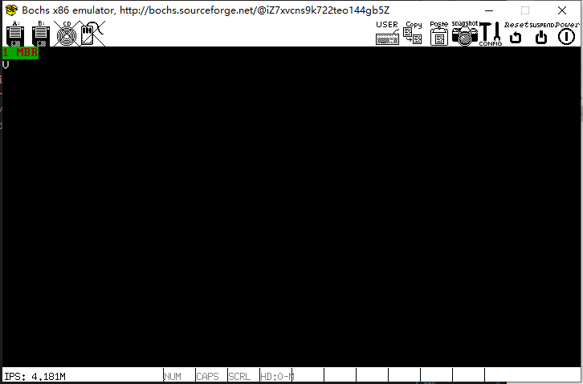