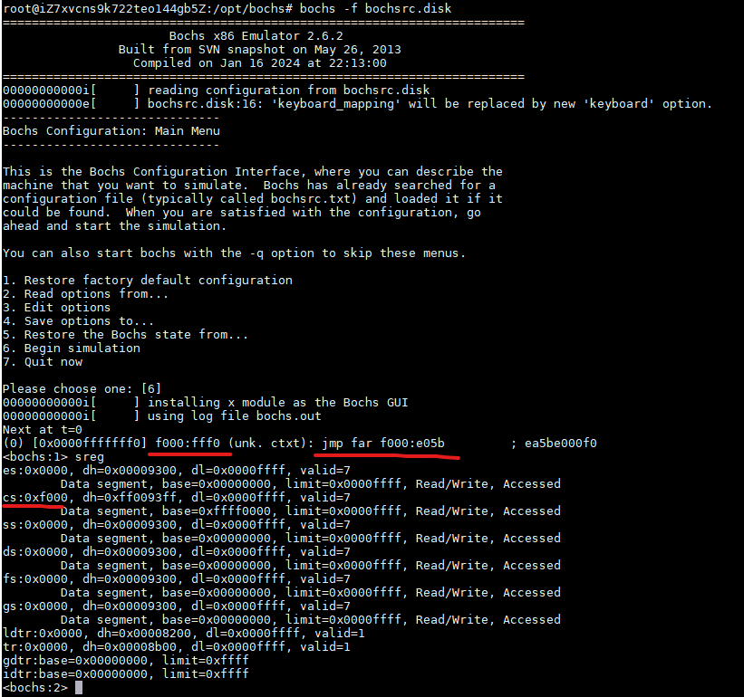

# 第二章

## BIOS

BIOS，Base Input & Output System，基本输入输出系统

### 实模式内存布局

Intel 8086有20条地址线，可访问1MB内存，地址范围为0x00000到0xFFFFF

内存布局表见书中53页

0xFFFF0到0xFFFFF，为**BIOS入口地址**，此处16字节内容为`jmp f000: e05b`

0-0x9FFFF，是DRAM，640KB，为**动态随机访问内存**

0xF0000-0xFFFFF，是ROM，64KB，是**BIOS的代码**，里面实现了对硬件的调用，建立了中断向量表

地址总线表达的地址，会被指向ROM、硬件设备控制权、显存、内存条等

### BIOS如何启动

BIOS入口地址是0xFFFF0，电脑开机上电的一瞬间，cs: ip寄存器会被强制初始化为0xF000: 0xFFF0，实模式下等效于地址0xFFFF0

BIOS会开始检测内存、显卡等外设信息，并初始化硬件，随后**在内存0x000-0x3FF建立终端向量表**，并编写中断例程

最后BIOS会校验**0盘0道1扇区**的内容，如果最后两个字节是**0x55和0xaa**，BIOS便认为此处有MBR，并加载其到**0x7c00**，然后`jmp 0: 0x7c00`

0x7c00，即32KB-1KB=0x8000-0x0400=0x7c00，32KB内存是因为是最小内存，最后1KB给MBR，避免内存被占用，程序占512B，栈占512B
