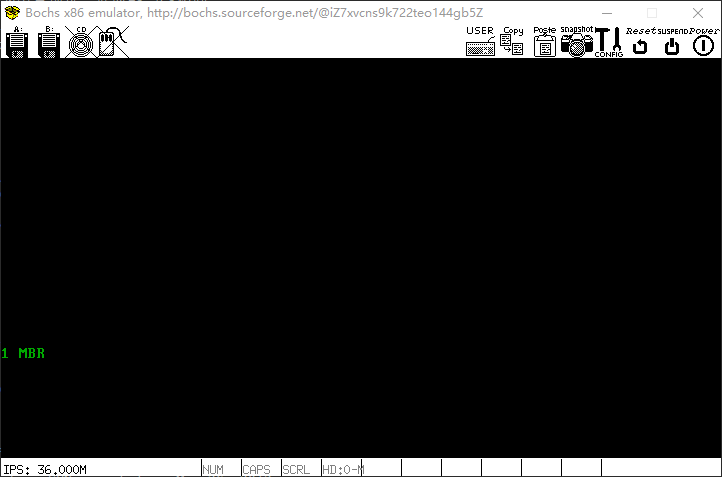

# 第二章

## BIOS

BIOS，Base Input & Output System，基本输入输出系统

### 实模式内存布局

Intel 8086有20条地址线，可访问1MB内存，地址范围为0x00000到0xFFFFF

内存布局表见书中53页

0xFFFF0到0xFFFFF，为**BIOS入口地址**，此处16字节内容为`jmp f000: e05b`

0-0x9FFFF，是DRAM，640KB，为**动态随机访问内存**

0xF0000-0xFFFFF，是ROM，64KB，是**BIOS的代码**，里面实现了对硬件的调用，建立了中断向量表

地址总线表达的地址，会被指向ROM、硬件设备控制权、显存、内存条等

### BIOS如何启动

BIOS入口地址是0xFFFF0，电脑开机上电的一瞬间，cs: ip寄存器会被强制初始化为0xF000: 0xFFF0，实模式下等效于地址0xFFFF0


BIOS会开始检测内存、显卡等外设信息，并初始化硬件，随后**在内存0x000-0x3FF建立终端向量表**，并编写中断例程

最后BIOS会校验**0盘0道1扇区**的内容，如果最后两个字节是**0x55和0xaa**，BIOS便认为此处有MBR，并加载其到**0x7c00**，然后`jmp 0: 0x7c00`

0x7c00，即32KB-1KB=0x8000-0x0400=0x7c00，32KB内存是因为是最小内存，最后1KB给MBR，避免内存被占用，程序占512B，栈占512B

### nasm编译器

汇编编译器

```shell
apt-get install -y nasm
```

直接命令安装`nasm`，redhat系用`yum`

## MBR

`label:`，label处会被替换为下面一行代码的地址

`$` 被替换为本行代码的地址，例如`jmp $`，就是死循环

`$$` 被替换为当前section的起始地址

```S
;主引导程序
SECTION MBR vstart=0x7c00
    mov ax,cs
    mov ds,ax ; ds/es/fs/gx无法直接赋值，因此使用ax中转
    mov es,ax
    mov ss,ax
    mov fs,ax
    mov sp,0x7c00 ; 此时0x7c00以下地址是安全区域，因此当做栈使用

;INT 0x10 功能号：0x06 目的：清屏
;AH 功能号：0x06
;AL 上卷行数
;BH 上卷行属性
;CL,CH 窗口左上角X,Y位置 ; 0, 0
;DL,DH 窗口右下角X,Y位置 ; 4*16+15=79, 1*16+8=24；所以能容纳80*25个字符
;无返回值
    mov ax,0x600
    mov bx,0x700
    mov cx,0
    mov dx,0x184f

    int 0x10

;获取光标位置
    mov ah,3 ; 获取光标位置
    mov bh,0 ; 待获取光标的页号

    int 0x10

;打印字符串
    mov ax,message
    mov bp,ax ; es:bp为串首地址，此时es与cs相同

    mov cx,5 ; cx为串长度，不包括结束符的字符个数
    mov ax,0x1301 ; 功能号：13，显示字符及属性；al=0x01：显示字符串，光标跟随移动

    mov bx,0x2 ; bh=0x00，存储要显示的页号；bl=0x02，字符属性，黑底绿字

    int 0x10

    jmp $ ; 功能结束，程序死循环

    message db "1 MBR"
    times 510-($-$$) db 0 ; 填充0到剩余空间
    db 0x55,0xaa ; x86为小端平台，511：0xaa，512:0x55
```

上述程序目的为，MBR，屏幕打印字符串`1 MBR`，背景黑色，字体绿色

将上述程序写入文件`mbr.S`，随后`nasm -o mbr.bin mbr.S`，将汇编语言编译为机器码

将机器码写入创建的硬盘`hd60M.img`（章节一末尾创建）

```shell
cd /opt/bochs
dd if=`pwd`/mbr.bin of=`pwd`/hd60M.img bs=512 count=1 conv=notrunc
```

启动bochs运行MBR，`./bin/bochs -f bochsrc.disk`，启动后会进入调试模式，按`c`，继续执行


