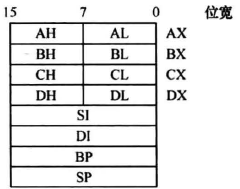
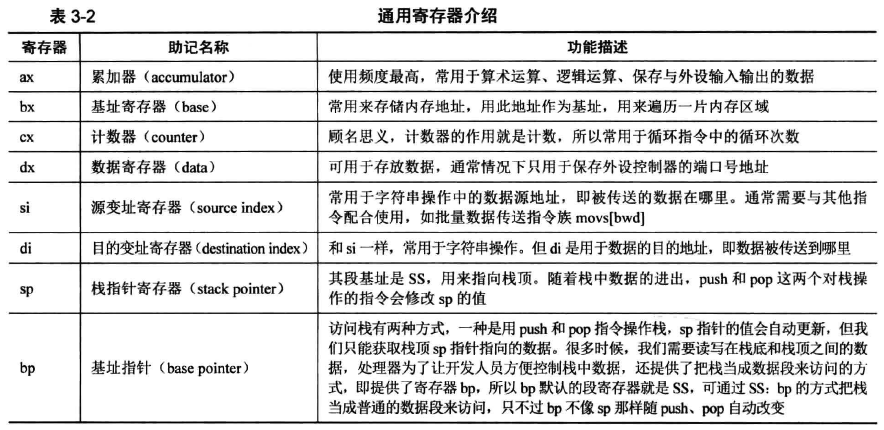
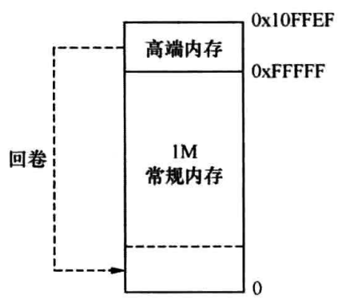
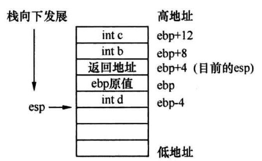

# 第三章

[toc]

## 地址、section、vstart

### 什么是地址

地址等于上一个地址+上一个地址处内容的长度

### 什么是section

为了让程序员在逻辑上将程序划分为几个段，这个编译器为程序员提供的能力

可以通过在汇编语言中使用section的名字，代替某个代码段的地址

### 什么是vstart

vstart是为section指定的虚拟地址，编译时，会将该section的开始地址设置为vstart的值

会影响诸如$/$$/label名次等地址的

不会影响`section.节名.start`，因为这是代码实际存放的地址

因为编译器只负责编址

## 实模式

### 什么是实模式

实模式是8086CPU的寻址方式、寄存器大小、指令用法等

### CPU工作原理

CPU可分为三个部分：

1. 控制单元
    由以下内容构成：
    * 指令寄存器、IR（Instruction Register）
    * 指令译码器、ID（Instruction Decoder）
    * 操作控制器、OC（Operation Controller）
2. 运算单元
    负责算术运算（加减乘除）和逻辑运算（比较、移位），从控制单元接受命令
3. 存储单元
    L1、L2缓存即寄存器，缓存基本采用SRAM（Static RAM）存储器

CPU运作流程：

1. 控制单元要获取下一条指令，指令地址在程序计数器PC上，在x86CPU上就是cs:ip
2. 读取ip寄存器，将地址上送到总线
3. 根据地址获取到指令，将其存入指令寄存器IR
4. 指令译码器ID检查指令寄存器IR中的指令，先确认操作码，再检查操作数类型，如果操作数再内存则将操作数放入自己的存储单元，如果操作数在寄存器则直接用
5. 操作控制器OC让运算单元执行命令
6. ip寄存器值被加上当前指令的大小，指向下个指令的地址
7. 循环至`1`

### CPU中的寄存器

分为两类：

1. CPU内部使用，对外不可见
    * 全局描述符表寄存器GDTR；使用lgdt指令为其制定全局描述符表的地址及偏移量
    * 中断描述符表寄存器IDTR；使用lidt指令为其指定终端描述符表地址
    * 局部描述附表寄存器LDTR；lgdt为其指定局部描述符表ldt
    * 任务寄存器TR；ltr指令指定任务状态段tss
    * 控制寄存器CR0~3
    * 指令指针寄存器IP
    * 标志寄存器flags；pushf和popf指令，将flags寄存器内容入栈与弹出到flags寄存器
    * 调试寄存器DR0~7
  ldt和tss都位于gdt中
2. 对外可见寄存器
    * 段寄存器
    * 通用寄存器

虽然有部分集群器不可见，但须由MBR初始化

**段基址寄存器**，也成段寄存器，**存储的是内存中的一段区域的起始地址**，无论是实模式还是保护模式，**长度都为16位**

|简称|全称|补充|
|----|----|----|
|CS|代码段寄存器|存储指令的操作码与寻址方式，内部是紧凑的|
|DS|数据段寄存器|类似代码段，存数据|
|ES|附加段寄存器|16位CPU中只有这一个附加段寄存器|
|FS|附加段寄存器|32位CPU增加的|
|GS|附加段寄存器|32位CPU增加的|
|SS|栈段寄存器|栈起始地址|

IP寄存器不可见，CS寄存器可见，都是16位宽

flags寄存器展示CPU内部各项设置、指标，实模式下是16位

通用寄存器有8个，AX、BX、CX、DX、SI、DI、BP、SP，可以用来存放任何数据和地址



EAX是在AX基础上又增加了16为，共32位，这是32位CPU在实模式下的工作状态

cx一般用作循环次数控制

bs一般用于存储起始地址



### 实模式下分段由来

x86中的x是一个变量，代表intel所有86系列产品，8086是第一个x86产品

8086是第一个使用“段+偏移量”的形式访问内存的CPU，地址总线为20位宽，寻址范围就是2的20次方，即1MB，0~0xFFFFF

段寄存器16位，段寄存器值左移4位+偏移量即为最终地址

可表示地址最大为：
    0xFFFF: 0xFFFF
        =0xFFFF\*2^4+0xFFFF
        =0xFFFF0+0xFFFF
        =0xFFFFF+0xFFF0
        =1M+16\*4KB-16-1
        =**0x10FFEF**

相比于0xFFFFF，多了**16\*4KB-16**字节，这部分内存就是**高端内存区（High Memory Area, HMA）**

超出0xFFFFF的内容会被取模，即丢掉，如0xFFFFF+2，结果为0x00001



### 实模式下的CPU内存寻址方式

寻址地址，大体分为三类，其中内存寻址又包含4种：

1. 寄存器寻址
2. 立即数寻址
3. 内存寻址
    * 直接寻址
    * 基址寻址
    * 变址寻址
    * 基址变址寻址

#### 寄存器寻址

指“数”在寄存器中，从寄存器中拿数据就行

例如：

```S
mov ax, 0x10
mov dx, 0x9
mul dx
```

#### 立即数寻址

带有立即数的指令，就是立即数寻址

例如：

```S
mov ax, 0x18
```

代表地址的宏也属于立即数，因为宏会被编译器转为立即数

#### 内存寻址

操作数在内存中的寻址方式称为内存寻址

访问内存的形式是 “段基址：段内偏移地址” ，且该形式只用在内存访问中。

默认数据段寄存器是DS，即段基址已经有了，因此段内偏移地址起决定作用，所以段内偏移地址也称为有效地址

##### 直接寻址

将操作数给出的数字作为内存地址，例如：

```S
; 将 DS:0x1234 处的值写入ax寄存器
mov ax, [0x1234] 
; 将 gs:0x5678 处的值写入ax寄存器
mov ax, [fs:0x5678]
; fs 意思是跨越段前缀，段基址变成了gs寄存器
```

##### 基址寻址

在操作数中，使用`bx`或`bp`寄存器作为地址的起始，地址变化以它为基础，**即只能以`bx`或`bp`作为*基址*寄存器**，实模式限制只能使用这两个寄存器，保护模式没有该限制

`bx`寄存器的默认段寄存器是`DS`，`bp`寄存器默认段寄存器是`SS`

例如：

```S
add word[bx], 0x1234
```

是将 `0x1234` 加上 `ds: bx` 内存处**存的值**后，再保存到 `ds: bx` 处

用到了立即数寻址和内存寻址两种方式，此处`ds`也需要*16

`bp`寄存器的默认段寄存器是`SS`，也就是说`bp`寄存器是用来访问栈的

已经有了`sp`寄存器访问栈，为什么还需要`bp`？

`sp`寄存器是栈顶指针，专门给push和pop做引导的寄存器，栈是从高地址往低地址生长

push原理如：

```S
sub sp, 2
mov sp, ax
```

pop原理如：

```S
mov ax, [sp]
add sp, 2
```

所以，sp不能乱动，使用bp来访问栈中的数据，使用`SS: bp`，即可随意访问栈中的数据

32位环境下，ebp应用在对栈框架中，ebp是bp的32位拓展

堆栈框架原理：

以32位环境下，C代码为例：

```c
int a=0;
function(int b, int c){
    int d;
}
a++;
```

1. 此时调用`function(1,2)`，从右向左将参数压如栈，先压2再压1，即先压c再压b，每个参数4字节
2. 压入function的返回地址，此时栈顶的值是指令a++的地址
3. `push ebp`; 将ebp压入栈，栈中备份了ebp的值（比如再调用函数的时候，返回后可以还原该值），占4字节
4. `mov ebp, esp`; 将esp的值复制进ebp，此时ebp就是栈顶
5. `sub esp, 4`; function中有变量d，为其预留4字节空间
   以ebp为基址，对栈中数据寻址
   [ebp-4]是局部变量d,对应步骤5
   [ebp]是ebp的备份，对应步骤3
   [ebp+4]是函数返回地址，对应步骤2
6. 函数结束后，跳过局部变量空间，`mov esp, ebp`
7. 恢复ebp值：`pop ebp`
   
8. 最后执行返回指令ret，然后执行`add esp, 8`，回收b和c的空间

堆栈框架是为了给函数分配局部变量空间的

堆栈框架的创建和回收工作，分别在进入函数和离开函数时进行

指令`enter`在函数进入时执行，其功能是备份`ebp`并使`ebp`更新为`esp`，对应步骤3和步骤4，即`push ebp`; `mov ebp, esp`

指令`leave`在函数离开时执行，其功能是回收局部变量空间并恢复`ebp`的值，对应步骤6和步骤7，即`mov esp, ebp`; `pop ebp`

##### 变址寻址

变址寻址与基址寻址类似，只是寄存器从`bx/bp`变成了`si/di`

`si`是源索引寄存器（source index），`di`是目的索引寄存器（destination index），两个寄存器的默认段寄存器也是`ds`

例如：

```S
mov [di], ax        ;将ax的值存入ds: di指向的内存
mov [si+0x1234], ax ;变址可以加变量
```

变址寻址主要用于字符搬运指令，这两个寄存器在很多指令都需要成对使用，如`movsb`, `movsw`, `movsd`等

##### 基址变址寻址

是基址寻址和变址寻址的结合，即`bx`或`bp`加上一个变址寄存器`si`或`di`，例如：

```S
mov [bx+di], ax ;将ax的值，送入以ds为段基址，bx+di为偏移量的内存
add [bx+si], ax ;将ax的值，加上[ds: bx+si]的内存中的值，并存入[ds: bx+si]
```

为什么会有以上几种寻址方式？

***每种寻址方式都对应一种电路实现，增加寻址方式将会增加电路复杂性，因此寻址方式是有限的***

例如，`mov ax, [cx+bx]`就行不通，虽然类似`mov ax, [bx+si]`，但硬件上无法实现

##### 栈是什么

CPU中有栈段`SS`寄存器和栈指针`SP`寄存器，是用来指定当前使用栈的物理地址

栈是一种线性表，元素先进先出，在栈顶进行数据存取，栈底不变

因此栈基址存入`SS`，栈顶存入`SP`，栈是一块内存区域，因此栈的内存地址使用`[SS]*16+SP`形成的20位地址表示，`[SS]`取得是`SS`作为地址处内存的值

栈是硬件实现，因此提供了`push`压栈和`pop`出栈

`push`先将`SP`减去字长，再存入`SP`，最后将数据存入`SP`指向的地址

`pop`现从`SP`指向的地址中取出值，然后再将`SP`加上字长，最后存入`SP`

字长是CPU一次能处理的数据的长度，实模式下字长是16位，即2字节
