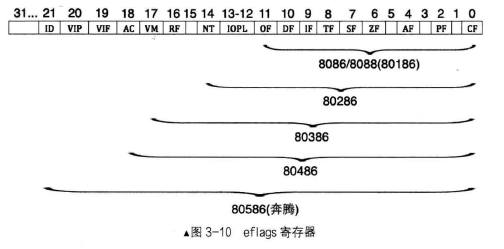
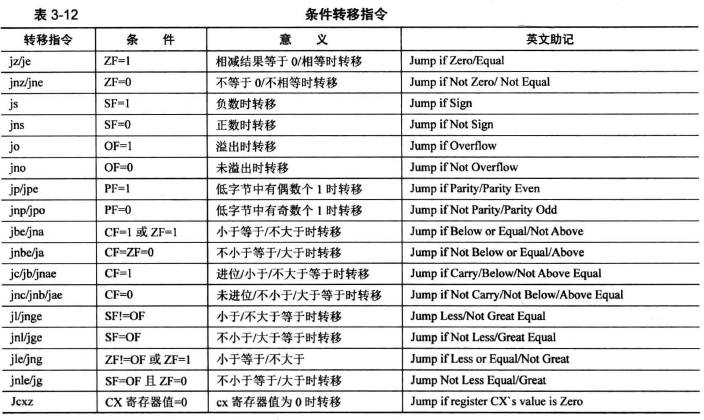

# 第三章

[toc]

## 地址、section、vstart

### 什么是地址

地址等于上一个地址+上一个地址处内容的长度

### 什么是section

为了让程序员在逻辑上将程序划分为几个段，这个编译器为程序员提供的能力

可以通过在汇编语言中使用section的名字，代替某个代码段的地址

### 什么是vstart

vstart是为section指定的虚拟地址，编译时，会将该section的开始地址设置为vstart的值

会影响诸如$/$$/label名次等地址的

不会影响`section.节名.start`，因为这是代码实际存放的地址

因为编译器只负责编址

## 实模式

### 什么是实模式

实模式是8086CPU的寻址方式、寄存器大小、指令用法等

### CPU工作原理

CPU可分为三个部分：

1. 控制单元
    由以下内容构成：
    * 指令寄存器、IR（Instruction Register）
    * 指令译码器、ID（Instruction Decoder）
    * 操作控制器、OC（Operation Controller）
2. 运算单元
    负责算术运算（加减乘除）和逻辑运算（比较、移位），从控制单元接受命令
3. 存储单元
    L1、L2缓存即寄存器，缓存基本采用SRAM（Static RAM）存储器

CPU运作流程：

1. 控制单元要获取下一条指令，指令地址在程序计数器`PC`上，在x86CPU上就是`cs:ip`
2. 读取`ip`寄存器，将地址上送到总线
3. 根据地址获取到指令，将其存入指令寄存器`IR`
4. 指令译码器`ID`检查指令寄存器`IR`中的指令，先确认操作码，再检查操作数类型，如果操作数再内存则将操作数放入自己的存储单元，如果操作数在寄存器则直接用
5. 操作控制器OC让运算单元执行命令
6. `ip`寄存器值被加上当前指令的大小，指向下个指令的地址
7. 循环至`1`

### CPU中的寄存器

分为两类：

1. CPU内部使用，对外不可见
    * 全局描述符表寄存器GDTR；使用lgdt指令为其制定全局描述符表的地址及偏移量
    * 中断描述符表寄存器IDTR；使用lidt指令为其指定终端描述符表地址
    * 局部描述附表寄存器LDTR；lgdt为其指定局部描述符表ldt
    * 任务寄存器TR；ltr指令指定任务状态段tss
    * 控制寄存器CR0~3
    * 指令指针寄存器IP
    * 标志寄存器flags；pushf和popf指令，将flags寄存器内容入栈与弹出到flags寄存器
    * 调试寄存器DR0~7
  ldt和tss都位于gdt中
2. 对外可见寄存器
    * 段寄存器
    * 通用寄存器

虽然有部分集群器不可见，但须由MBR初始化

**段基址寄存器**，也成段寄存器，**存储的是内存中的一段区域的起始地址**，无论是实模式还是保护模式，**长度都为16位**

|简称|全称|补充|
|----|----|----|
|CS|代码段寄存器|存储指令的操作码与寻址方式，内部是紧凑的|
|DS|数据段寄存器|类似代码段，存数据|
|ES|附加段寄存器|16位CPU中只有这一个附加段寄存器|
|FS|附加段寄存器|32位CPU增加的|
|GS|附加段寄存器|32位CPU增加的|
|SS|栈段寄存器|栈起始地址|

IP寄存器不可见，CS寄存器可见，都是16位宽

flags寄存器展示CPU内部各项设置、指标，实模式下是16位

通用寄存器有8个，AX、BX、CX、DX、SI、DI、BP、SP，可以用来存放任何数据和地址


EAX是在AX基础上又增加了16为，共32位，这是32位CPU在实模式下的工作状态

cx一般用作循环次数控制

bs一般用于存储起始地址


### 实模式下分段由来

x86中的x是一个变量，代表intel所有86系列产品，8086是第一个x86产品

8086是第一个使用“段+偏移量”的形式访问内存的CPU，地址总线为20位宽，寻址范围就是2的20次方，即1MB，0~0xFFFFF

段寄存器16位，段寄存器值左移4位+偏移量即为最终地址

可表示地址最大为：
    0xFFFF: 0xFFFF
        =0xFFFF\*2^4+0xFFFF
        =0xFFFF0+0xFFFF
        =0xFFFFF+0xFFF0
        =1M+16\*4KB-16-1
        =**0x10FFEF**

相比于0xFFFFF，多了**16\*4KB-16**字节，这部分内存就是**高端内存区（High Memory Area, HMA）**

超出0xFFFFF的内容会被取模，即丢掉，如0xFFFFF+2，结果为0x00001


### 实模式下的CPU内存寻址方式

寻址地址，大体分为三类，其中内存寻址又包含4种：

1. 寄存器寻址
2. 立即数寻址
3. 内存寻址
    * 直接寻址
    * 基址寻址
    * 变址寻址
    * 基址变址寻址

#### 寄存器寻址

指“数”在寄存器中，从寄存器中拿数据就行

例如：

```S
mov ax, 0x10
mov dx, 0x9
mul dx
```

#### 立即数寻址

带有立即数的指令，就是立即数寻址

例如：

```S
mov ax, 0x18
```

代表地址的宏也属于立即数，因为宏会被编译器转为立即数

#### 内存寻址

操作数在内存中的寻址方式称为内存寻址

访问内存的形式是 “段基址：段内偏移地址” ，且该形式只用在内存访问中。

默认数据段寄存器是DS，即段基址已经有了，因此段内偏移地址起决定作用，所以段内偏移地址也称为有效地址

##### 直接寻址

将操作数给出的数字作为内存地址，例如：

```S
; 将 DS:0x1234 处的值写入ax寄存器
mov ax, [0x1234] 
; 将 gs:0x5678 处的值写入ax寄存器
mov ax, [fs:0x5678]
; fs 意思是跨越段前缀，段基址变成了gs寄存器
```

##### 基址寻址

在操作数中，使用`bx`或`bp`寄存器作为地址的起始，地址变化以它为基础，**即只能以`bx`或`bp`作为*基址*寄存器**，实模式限制只能使用这两个寄存器，保护模式没有该限制

`bx`寄存器的默认段寄存器是`DS`，`bp`寄存器默认段寄存器是`SS`

例如：

```S
add word[bx], 0x1234
```

是将 `0x1234` 加上 `ds: bx` 内存处**存的值**后，再保存到 `ds: bx` 处

用到了立即数寻址和内存寻址两种方式，此处`ds`也需要*16

`bp`寄存器的默认段寄存器是`SS`，也就是说`bp`寄存器是用来访问栈的

已经有了`sp`寄存器访问栈，为什么还需要`bp`？

`sp`寄存器是栈顶指针，专门给push和pop做引导的寄存器，栈是从高地址往低地址生长

push原理如：

```S
sub sp, 2
mov sp, ax
```

pop原理如：

```S
mov ax, [sp]
add sp, 2
```

所以，sp不能乱动，使用bp来访问栈中的数据，使用`SS: bp`，即可随意访问栈中的数据

32位环境下，ebp应用在对栈框架中，ebp是bp的32位拓展

堆栈框架原理：

以32位环境下，C代码为例：

```c
int a=0;
function(int b, int c){
    int d;
}
a++;
```

1. 此时调用`function(1,2)`，从右向左将参数压如栈，先压2再压1，即先压c再压b，每个参数4字节
2. 压入function的返回地址，此时栈顶的值是指令a++的地址
3. `push ebp`; 将ebp压入栈，栈中备份了ebp的值（比如再调用函数的时候，返回后可以还原该值），占4字节
4. `mov ebp, esp`; 将esp的值复制进ebp，此时ebp就是栈顶
5. `sub esp, 4`; function中有变量d，为其预留4字节空间
   以ebp为基址，对栈中数据寻址
   [ebp-4]是局部变量d,对应步骤5
   [ebp]是ebp的备份，对应步骤3
   [ebp+4]是函数返回地址，对应步骤2
6. 函数结束后，跳过局部变量空间，`mov esp, ebp`
7. 恢复ebp值：`pop ebp`
   
8. 最后执行返回指令ret，然后执行`add esp, 8`，回收b和c的空间

堆栈框架是为了给函数分配局部变量空间的

堆栈框架的创建和回收工作，分别在进入函数和离开函数时进行

指令`enter`在函数进入时执行，其功能是备份`ebp`并使`ebp`更新为`esp`，对应步骤3和步骤4，即`push ebp`; `mov ebp, esp`

指令`leave`在函数离开时执行，其功能是回收局部变量空间并恢复`ebp`的值，对应步骤6和步骤7，即`mov esp, ebp`; `pop ebp`

##### 变址寻址

变址寻址与基址寻址类似，只是寄存器从`bx/bp`变成了`si/di`

`si`是源索引寄存器（source index），`di`是目的索引寄存器（destination index），两个寄存器的默认段寄存器也是`ds`

例如：

```S
mov [di], ax        ;将ax的值存入ds: di指向的内存
mov [si+0x1234], ax ;变址可以加变量
```

变址寻址主要用于字符搬运指令，这两个寄存器在很多指令都需要成对使用，如`movsb`, `movsw`, `movsd`等

##### 基址变址寻址

是基址寻址和变址寻址的结合，即`bx`或`bp`加上一个变址寄存器`si`或`di`，例如：

```S
mov [bx+di], ax ;将ax的值，送入以ds为段基址，bx+di为偏移量的内存
add [bx+si], ax ;将ax的值，加上[ds: bx+si]的内存中的值，并存入[ds: bx+si]
```

为什么会有以上几种寻址方式？

***每种寻址方式都对应一种电路实现，增加寻址方式将会增加电路复杂性，因此寻址方式是有限的***

例如，`mov ax, [cx+bx]`就行不通，虽然类似`mov ax, [bx+si]`，但硬件上无法实现

##### 栈是什么

CPU中有栈段`SS`寄存器和栈指针`SP`寄存器，是用来指定当前使用栈的物理地址

栈是一种线性表，元素先进先出，在栈顶进行数据存取，栈底不变

因此栈基址存入`SS`，栈顶存入`SP`，栈是一块内存区域，因此栈的内存地址使用`[SS]*16+SP`形成的20位地址表示，`[SS]`取得是`SS`作为地址处内存的值

栈是硬件实现，因此提供了`push`压栈和`pop`出栈

`push`先将`SP`减去字长，再存入`SP`，最后将数据存入`SP`指向的地址

`pop`现从`SP`指向的地址中取出值，然后再将`SP`加上字长，最后存入`SP`

字长是CPU一次能处理的数据的长度，实模式下字长是16位，即2字节

### 实模式下的`ret`

`call/ret/jmp`原理上都是修改寄存器`CS`和`IP`的值，将CPU导向新的位置

`call`指令用来指定一段新的代码，需要`ret`返回

`call`指令，压入了返回地址，为能够回来埋下伏笔

CPU依靠程序计数器`PC`指路，x86中的程序计数器是`CS: IP`，且`call`指令后，程序计数器`PC`的值会存在栈中

`ret`会在栈顶（`ss: sp`指向的地址）弹出两个字节的内容替换`IP`寄存器，`ret`会使`sp`指针+2，因为栈向下生长，`ret`属于近返回

`retf`会在栈顶弹出四个字节的内容，栈顶的两个字节替换`IP`寄存器，另外两个字节替换`CS`寄存器，属于远返回，`retf`会使`sp`指针+4

`ret`和`retf`不会检查弹出的内容是什么，因此程序员需要知道栈顶的数据是什么

`ret`的种类需要根据`call`的类型选择

`call`和`ret`是一对，`call far`和`retf`是一对

### 实模式下的`call`

8086中，有`jmp`和`call`用于改变程序流程，`jmp`用于交接，例如BIOS到MBR，`call`用于执行一段后返回

实模式下`call`调用函数有四种方式，两种近调用，两种远调用

#### 16位实模式相对近调用

***近*** 是指目标函数和当前代码段是同一个段，即再同一个64KB的空间内，也就是16位能表达的最大范围，所以**只给出段内偏移地址**即可，无需给出段基址

与近相关的调用可以用关键字`near`修饰，表示再内存或寄存器取2字节，`near`可以省略，nasm编译器默认取2字节

***相对*** 是指在同一个代码段，只需要给出目标函数的相对地址

指令格式是`call near 立即数地址`，其中`near`可以省略，指令长3字节，操作码是`0xe8`，剩下两字节是操作数

立即数可以是被调用函数的函数名、标号、立即数，如`call near prog_name`，但是`prog_name`会被编译器编译为相对目标地址的**偏移量**，即目标地址减去当前`call`指令的地址，**所得差再减去该指令长度3**，为什么要减3呢，即为什么要减去`call`指令的长度呢，因为`call`命令后，`IP`会被压入栈，然后CPU会计算出目标函数绝对地址，算法为：**当前的IP地址+操作数+机器码长度=目标函数绝对地址**,得出的地址会被载入`IP`寄存器

这个立即数，即相对量，范围是`-2^15~2^15-1`，即`-32768~32767`，操作数有符号位

**在同一段内的函数调用（近调用）,必须使用相对地址形式**，这是硬件设计问题

`xxd`命令是逐字节查看文件的

```sh
# -u 使用大写的16进制表示字节内容
# -a 使用单个*替换空格
# -g 几个字节间隔一个空格，即几个字节算一组，每组用空格分隔
# -s seek，定位，从第几个字节开始，从0起始
# -l 读取字节个数
# 最后跟文件路径
xxd -u -a -g 1 -s $2 -l $3 $1
```

> x86是小端字节序，即低位存在低地址
> 如何理解呢？
> 拿机器码`e8llhh`为例，e8为操作码，操作码在最前面，后面的为操作数，以字节为单位，低位存在低地址，所以操作数为`0xhhll`
> 这里可能会搞混，操作数为`0xhhll`，为什么机器码是`llhh`，因为低位在低地址，`ll`是低位的，所以在前面先写，所以`ll`挨着操作码

可以写个汇编代码编译成机器码后，用`xxd`指令查看文件字节内容

如下代码

```S
call near near_proc
jmp $
addr add 4
near_proc:
  mov ax, 0x1234
    ret
```

#### 16位实模式间接绝对近调用

**间接** 指目标函数地址没有直接给出，即不是立即数的形式，而是在寄存器或者内存中；

**绝对** 是指目标函数的地址是绝对地址

如：`call [addr]`和`call ax`，分别是通过内存调用和通过寄存器调用，机器码为`ff16`，`ret`机器码为`c3`

`vstart`要定义在`section`后面

`word`表示两个字节，即16位，除此之外还有`byte`, `dword`, `qword`，分别是1字节、4字节、8字节，这类关键字相当于类型强制转换

`far`表示取4字节，`short`表示取1字节

#### 16位实模式直接绝对远调用

**直接** 是指操作数再指令中直接给出，是立即数

由于是远调用，因此`CS`和`IP`都要用新的，即`call`时会把老的`CS`和`IP`依次压入栈，并使用新的`CS`和`IP`替换

指令形式为：`call far 段基址(立即数):段内偏移地址(立即数)`，`far`可以省略

操作码是`0x9a`，机器码是`0x9a+2字节偏移地址+2字节段基址`，偏移地址和段基址与指令顺序相反

例如：`call 0: far_proc`，且使用`retf`返回

#### 16位实模式间接绝对远调用

**间接** 是指段基址和段内偏移地址都不是立即数，都存在内存中，为什么不在寄存器中，因为段基址和段内偏移地址都是16位，这就需要两个寄存器，但寄存器资源稀缺，所以干脆都不用寄存器

指令形式为：`call far 内存寻址`，内存内容大小为4字节，前（低）2字节是段内偏移地址，后（高）2字节是段基址。此调用的`far`无法省略，否则与间接近调用一样了，机器码为`ffle`，`retf`机器码为`cb`

例如：`call far [0x1234]`，即取`ds*16 + 0x1234`处的4字节，前两字节为偏移地址，后两字节为段基址

***前两种近调用最常用***

### 实模式下的jmp

`jmp`只要更新`CS`:`IP`寄存器或`IP`寄存器的值

`jmp`一共有5类

#### 16位实模式相对短转移

格式为：`jmp short 立即数地址`，操作码为`0xeb`占1字节，操作数占1字节，一共2字节

跳转范围为`-128~127`

关键字`short`是指明让编译器将`jmp`编译为相对短转移，如果省略，操作数如果在上述范围，就会编译为相对短转移

例如`jmp $`就会编译为`jmp -2`，即机器码`0xebfe`

#### 16位实模式相对近转移

格式为：`jmp near 立即数地址`，操作码为`0xe9`占1字节，操作数占2字节，一共3字节

操作数范围增大，由8位变成16位宽，范围是`-32768~32767`

如果操作数超过16位，编译器会忽略超出16位的部分

#### 16位实模式间接绝对近转移

格式为：`jmp near 寄存器寻址`或`jmp near 内存寻址`，`near`表示去2字节，默认`near`，操作码为`0xff`，`near`编译后会被替换为`word`

间接指，其目标地址存在寄存器或内存

若操作数在内存，不使用段跨越前缀时，段基址寄存器是`DS`

近转移指，`CS`寄存器值不变，将操作数中的2字节载入`IP`寄存器

#### 16位实模式直接绝对远转移

格式为：`jmp 立即数形式的段基址: 立即数形式的段内偏移地址`，操作码为`0xea`

`jmp far 0000:0x0985`的机器码为`ea85090000`，机器码的段基址在后

**直接**，指操作数是CPU能直接用的立即数

**绝对**，是指操作数是绝对地址

**远**，指跨段

#### 16位实模式间接绝对远转移

格式为：`jmp far 内存寻址`，内存中将存4个字节，前两个字节是段内偏移地址，后两个字节是段基址，操作码为`0xff`

`jmp far ds:0x984`的机器码为`ff2e8409`，`2e`标识`DS`寄存器

在不使用段跨越前缀时，段基址寄存器是`DS`

### 标志寄存器 flags

`jmp`为无条件转移，所以也有有条件转移，这些条件存放在标志寄存器`flags`中

实模式下标志寄存器为16位长的flags，32位保护模式下为32位长的eflags



|第N位|简写|作用|
|----|----|----|
|0|CF|是否进位|
|1|无|空的占用位|
|2|PF|是否为奇偶位|
|3|无|空的占用位|
|4|AF|辅助进位标志|
|5|无|空的占用位|
|6|ZF|0标志位，运算结果是否为0|
|7|SF|符号标志位，运算结果是否为负|
|8|TF|陷阱标志位，若为1，CPU进入单步运行模式，反之连续工作模式|
|9|IF|中断标志位，1表示中断开启，响应CPU外部可屏蔽中断，内部异常无法屏蔽|
|10|DF|方向标志位，1表示地址减一，0表示地址加一|
|11|OF|溢出标志位，计算结果是否有溢出|

### 有条件转移



## 让我们直接对显示器说点什么吧

### CPU如何与外设通信-IO接口

CPU系统总线上传送的数据都是并行数据，而外设串行、并行都有

CPU和外设通过IO接口层相互通信，IO接口层实现了串行、并行等数据的代理转换处理

IO接口是连接CPU与外部设备的逻辑控制部件，包含硬件和软件
硬件可以通过添加缓冲区解决数据传输速率问题，数据格式不匹配可以添加转换格式的组件；
软件是控制接口电路工作的驱动程序以及完成内部数据传输所需要的的程序

IO接口芯片按照是否能够编程，分为可编程接口芯片和不可编程接口芯片

通过软件指令选择IO接口上的功能、工作模式的做法，叫做 “IO接口控制编程”。通常用端口读写指令in/out实现

IO接口的功能：

1. 设置数据缓冲
解决CPU与外设的速度不匹配
2. 设置信号电平转换电路
CPU用的信号是TTL电平，而外设大多数是机电设备
3. 设置数据格式转换
外设输出信息可能是数字信号、模拟信号灯，而CPU只能处理数字信号，都是数字信号时，数据宽度和串并行也可能不一样
4. 设置时序控制电路来同步CPU和外部设备
外设与CPU时序不同
5. 提供地址译码
一个IO接口必须包含多个端口，即IO接口上的寄存器，但同一时刻只能有一个端口与CPU数据交换，这需要IO接口提供地址译码电路，使CPU可以选中某个端口，使其可以访问数据总线

硬件只要符合以上约定，便能够与CPU数据交换

CPU使用主板上的物理链路访问IO接口，物理链路即主板（线路板）上的电线，也称为**信号线**，这条线是各设备都能使用的公共线路，因此也称为**总线**

CPU只能和一个IO接口通信，**输入输出控制中心**（I/O control hub,ICH），也称**南桥**芯片，提供了**仲裁IO接口竞争的能力**

南桥用于连接pci, pci-express, AGP等低速设备；
北桥用于连接高速设备，如内存；AMD将北桥集成到了CPU

**CPU**与**南桥芯片的CPU接口**有一个专门的总线用于通信

南桥集成了一些IO接口，如并口硬盘PATA，串口硬盘SATA，USB，PCI设备，电源管理等接口

南桥为了支持非必要设备，提供了专门用于拓展的接口，PCI接口，也就是主板上很多的插槽，即插即用，这条延长的PCI接口也称**PCI总线**

总线其实就是电线

IO接口被设计成使用IO接口内部的寄存器与CPU通信，为了与CPU的寄存器区分，IO接口中的寄存器就成为端口

端口是寄存器，寄存器有数据宽度，有8、16、32位

如何访问端口？rom可以通过内存映射来访问，端口也可以；端口也可以独立编址，位于一个IO接口的端口号都是连续的

IA32体系系统中，存储端口号的寄存器是32位，因此最多可以有65536个端口，即0~65535

内存映射，端口可以通过mov指令操作，由于独立编址，CPU提供了`in`和`out`指令来处理

`in`指令用于从端口中读取数据，如：
`in al, dx`
`in ax, dx`
`al`和`ax`用于存储从端口获取的数据，`dx`指端口号
`in`指令，只能使用`dx`作为源操作数，目的操作数使用`al`还是`ax`取决于`dx`是8位还是16位

`out`指令用于往端口写入数据，如：
`out dx, al`
`out dx, ax`
`out 立即数, al`
`out 立即数, ax`

不管是`in`还是`out`，`al`寄存器存8位数据，`ax`寄存器存16位数据

`in`只能用`dx`作为端口号
`out`既能用`dx`也能用**立即数**充当端口号
