# 第四章

## 保护模式概述

实模式存在的问题

1. 实模式操作系统与用户程序处于同一特权级
2. 用户程序引用的地址都是真实物理地址
3. 用户程序可以随意修改段基址，可以访问所有内存
4. 访问超过64KB内存需要切换段基址
5. 一次只能运行一个程序
6. 共20条地址线，最大可用内存为1MB

地址转换需要CPU与OS相互配合，CPU在硬件提供地址转换部件，OS提供转换过程所需要的页表

32位CPU具有保护模式和实模式两种运行模式，可以兼容实模式下的程序

实模式下CPU运行环境16位，保护模式下CPU运行环境32位

## 初见保护模式

除了断寄存器，其他寄存器都拓展到了32位

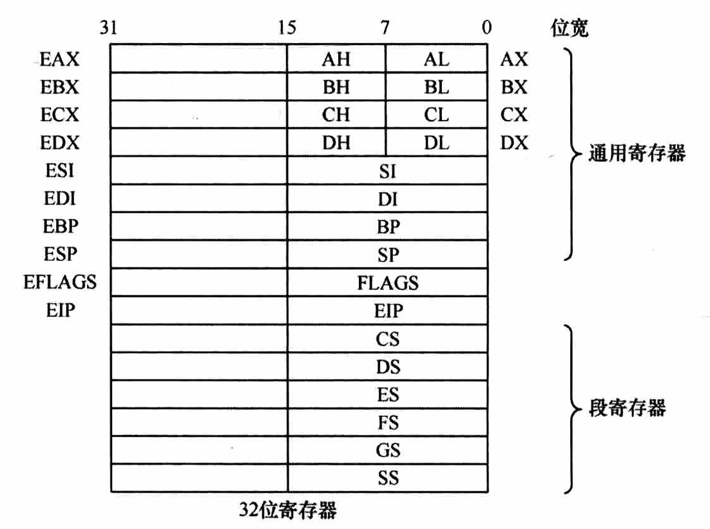

保护模式的安全性，很大一部分体现在内存段的描述方面，“全局描述符表”存储了对内存段的描述信息（约束条件）

每一个表项成为段描述符，大小为64字节，**描述了各内存段的起始地址、大小、权限等信息**

全局描述附表很大，并且存在内存中，**GDTR寄存器**指向他

所以，段寄存器不保存段基址，保存内容为“**选择子**”，选择子是一个数，用来索引全局描述附表的段描述符，类似于数组中的下标

1. 段描述符存在内存，这对CPU来说太慢了
2. 段描述符，一个数据存在三个地方，整合数据也要花时间

所以，CPU对段寄存器应用了缓存技术（**段描述符缓冲寄存器**, Descriptor Cache Registers），CPU每次将内存段信息整理后，就存入段描述符缓冲寄存器，每次访问相同段就可以直接读缓存

段描述符缓冲寄存器也可用在实模式下

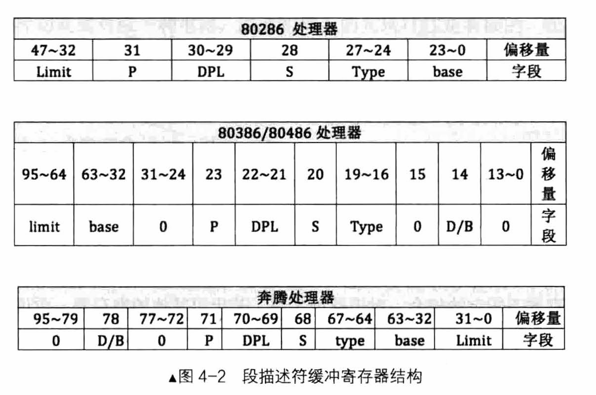

实模式与保护模式寻址方式对比


实模式下：
`BX`的段寄存器为`ds`，经常用于访问数据
`BP`的段寄存器为`ss`，经常用于访问栈

保护模式下：
基址寄存器为所有通用32为寄存器
变址寄存器为除了`esp`外所有的通用寄存器

### 保护模式之运行模式反转

`bits`指令是编译器提供的，用于传达以下代码的运行环境是实模式还是保护模式

`bits`指令格式为：`[bits 16]`或`[bits 32]`，即指定为16位机器码或32位机器码

指令范围是从当前`bits`到下一个`bits`

`bits`外的中括号可以忽略，默认为`[bits 16]`

**进入保护模式需要三个步骤**：

1. 打开A20
2. 加载gdt
3. 将cr0的pe位，置1

以上三个步骤可以无序、可以不连续

不同模式下的指令，操作码相同，寻址方式与操作数类型相同，但意义不同

指令格式中有个“前缀”字段，里面存放了指令的选项，比如指令重复前缀`rep`、段跨越前缀“段寄存器：”

操作数反转前缀：`0x66`，寻址方式反转前缀`0x67`

操作数反转前缀`0x66`，能临时将运行模式转变为另一种模式，比如实模式下临时使用保护模式的操作数大小，只在当前指令生效

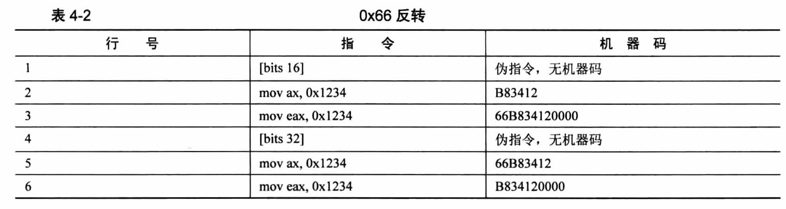

寻址方式反转前缀`0x67`，能临时使用另一种方式的寻址方式

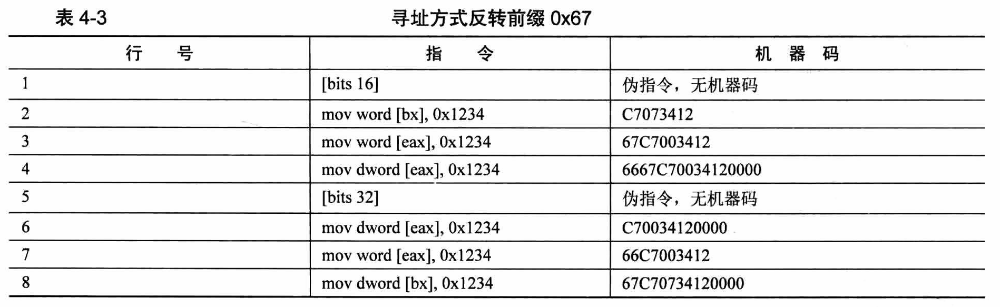

### 保护模式之指令扩展

`mul`指令
如果乘数是8位，`al`作为另一个乘数，结果16位存入`ax`；
如果乘数是16位，`ax`作为另一个乘数，结果32位存入`dx: ax`；
如果乘数是32位，`eax`作为另一个乘数，结果64位存入`edx: eax`；

## 全局描述符表

全局描述符表是内存段的属性表

全局描述符表解决了什么问题

1. 实模式下不能让用户程序破坏存储代码的内存区域
2. 实模式下用户程序与操作系统同级，需要划分特权级进行区分
3. 存储段的各种信息

段描述符，描述一个内存段，8个字节大，内存空间必须是连续的

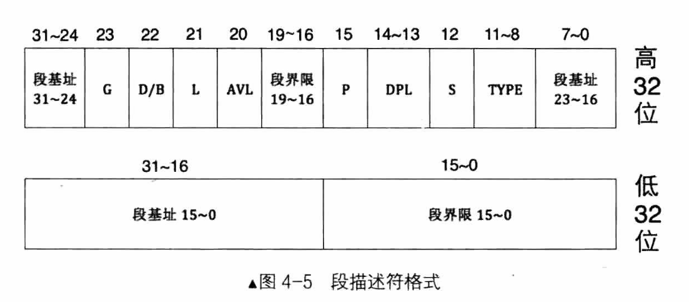

### 段界限

段界限，表示段内偏移量的边界、大小、范围，限制段内偏移地址，段向上或向下生长，即最大值或最小值

段界限用20个二进制位表示，段界限是一个单位量，单位要么是字节要么是4KB，由段内描述符G指定，所以段的大小要么是`2^20=1MB`要么是`2^(20+12)=4GB`

```
段界限边界值 = （描述符中段界限+1） * （段界限的粒度大小：4KB或1） - 1
```

超过段界限限制范围的偏移地址都会被认为是非法访问，会被CPU硬件捕获，并触发相应的异常，触发自己写的异常处理程序

段信息会被CPU整理后缓存到段描述符缓冲寄存器中，其中的段界限与段基址已经被拼合到一起了，所以不会有效率问题

### type字段

`type`字段共4位，用来指定描述符的类型，表示内存段或门的子类型

`S`字段决定段描述符是 **系统段** （0） 还是 **非系统段** （1）（代码段、数据段）

系统段：各种称为“门”的结构，硬件系统需要的结构，非软件使用，如：调用门、任务门。是入口，通往一段程序

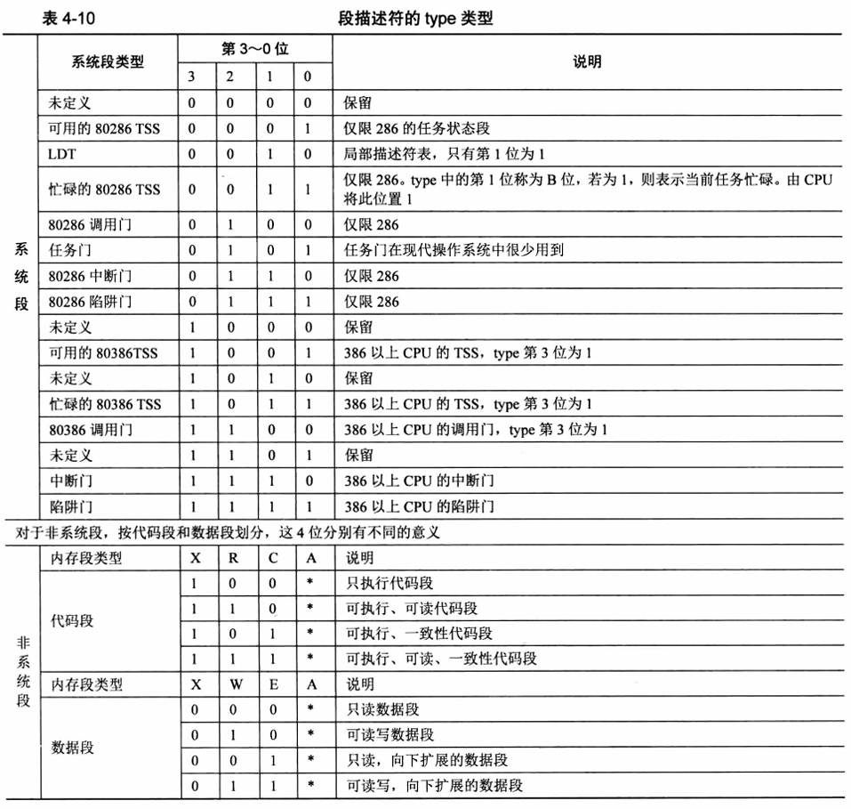

#### 非系统段

A 位表示 Accessed 位，由CPU设置，该断被CPU访问后置1，创建新描述符段时置0，可根据此位判断该描述符是否可用

C 表示一致性代码段，依从代码段，Conforming
如果自己是转移的目标段，并且自己是一致性代码段，自己的特权级就一定要高于当前特权级，转移后的特权级与转移前的地特权级一致
1 表示 是一致性代码段，0 表示 不是一致性代码段

R 表示可读，R为1表示可读，0表示不可读，用来限制代码段的访问，CPU发现某些指令对R为0的段进行访问时，将抛出异常，是用来限制代码指令的，不是限制CPU的

X 表示该段是否可执行，代码段可执行，为1；数据段不可执行，为0

E 标识段的扩展方向，Extend，E 为 0 表示向上扩展，地址越来越高；E 为 1 表示向下扩展，地址越来越低，通常用于栈

W 表示该段是否可写，代码段不可写，为0；数据段可写，为1。对W为0的段写入，会引发CPU抛出异常

DPL 描述符特权级，13-14位，指所代表内存段的特权级，是保护模式才有的东西
表示4位特权级，分别是0、1、2、3，数字越小特权级越大
CPU由实模式进入保护模式会自动进入`特权级0`，用户程序通常处于`特权级3`，某些指令只能在`特权级0`下执行

P 表示段是否在内存中，存在为1，不存在为0，P字段由CPU检查，为0则抛出异常，跳转至异常程序，异常程序处理完后要置为1；CPU负责检查，我们负责赋值

AVL字段，可用的字段，提供给操作系统的用的位

L 字段，用来设置是否为64位代码段，为1为64位，为0为32位

D/B字段，指示有效地址（段内偏移地址）及操作数的大小，对应代码段或栈段
对于代码段，D为0，有效地址和操作数是16位，为1是32位，指令有效地址用`IP`和`EIP`寄存器
对于栈段，B为0，使用`sp`寄存器16位；为1，使用`esp`寄存器32位

G 指定段界限的单位是1字节还是4KB，为1是4KB，为0是1字节

### 全局描述符GDT、局部描述符LDT、选择子 {#GDT_LDT_选择子}

代码段要占用一个段描述符、数据段和栈段，每个内存段占用一个段描述符

全局描述符位于内存，需要专门的寄存器指向他，CPU才知道它在哪，这个寄存器叫GDTR，及GDT Register

GDTR专门存储GDT的内存地址和大小，GDTR是一个48位寄存器

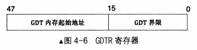

`lgdt`，初始化`gdt`的指令，可以在进入保护模式后换一个`gdt`，是因为实模式下只能访问1MB内存，所以保护模式突破内存限制后需要换`gdt`

`lgdt`格式：`lgdt 48位内存数据`

GDT大小为16位二进制，因此可访问2^16=65536字节，每个描述符大小8字节，因此GDT最大容纳65536/8=8192个段或门

实模式下，段寄存器存放的是段基址
保护模式下，**段寄存器**存放的是**选择子**，选择子是段描述符表对段描述符的索引

选择子结构：

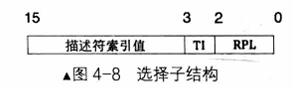

* RPL：请求特权级
* TI位：Table Indicator，表示这个选择子在GDT（0）还是LDT（1）
* 段描述符索引值，GDT的下标，13位，表示8192个

虽然保护模式用了选择子，但是还是得用“段基址：段内偏移地址”的形式访问内存

保护模式下，段基址不用乘以16

GDT的第0个段描述符不可用，为了避免忘记初始化GDT的情况

LDT是局部描述符表，设想是一个任务对应一个LDT，但实际上，现代操作系统很少用LDT

### 打开A20地址线

地址回绕：“wrap-around”，段基址*16+段内偏移量大于20位所能表示的最大空间，后地址对1MB求模，超过1MB的内存称为高位内存区`HMA`

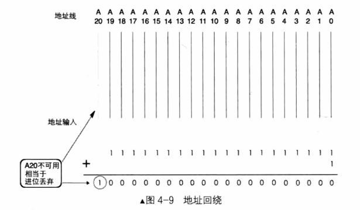

8086/8088，CPU地址总线只有20位，而80286及后面的CPU都超过了20位，但实模式下为了兼容，由必须保证有地址回绕的特性，因此有A20地址线控制是否需要地址回绕

A20也称A20Gate，被打开后，访问0x100000~0x10FFEF之间的地址时，CPU将访问真正的内存；反之进行地址回绕

打开方式，端口0x92的第1位置1：

```S
in al, 0x92
or al, 0000_0010B ; 这里的_，会被编译器忽略
out 0x92, al
```

### 保护模式的开关，CR0寄存器的PE位

控制寄存器CRx是CPU的窗口，可以展示CPU的状态，也可以控制CPU的运行机制，可见[保护模式之运行模式反转](#保护模式之运行模式反转)

CR0寄存器的第0位，即PE位（Protection Enable），是保护模式的开关，CPU开启保护模式三步中的一步

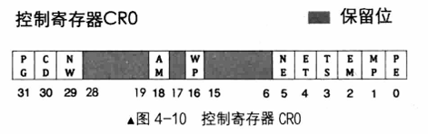

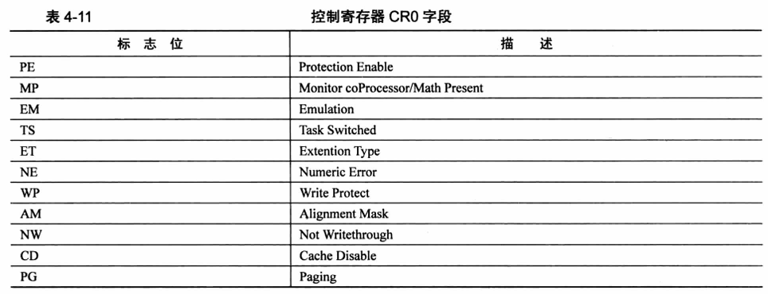

PE位置1：

```S
mov eax, cr0
or eax, 0x00000001
mov cr0, eax
```

### 进入保护模式

保护模式在`loader.bin`中进入，因此`loader.S`需要更新

另外`loader.bin`超过了512字节，因此需要`mbr.S`加载`loader.bin`的读入扇区加大，现在是1，可以先改成4

最后是`include/boot.inc`需要更新，即配置信息需要更新

内容可参考[全局描述符表](#全局描述符表)，以及[全局描述符GDT、局部描述符LDT、选择子](#GDT_LDT_选择子)

`include/boot.inc`：

```S
; loader和kernel
LOADER_BASE_ADDR equ 0x900
LOADER_START_SECTOR equ 0x2

; gdt描述符
DESC_G_4K equ 1_000_0000_0000_0000_0000_0000b   ;段描述符的G位，为4K粒度
DESC_D_32 equ 1_00_0000_0000_0000_0000_0000b    ;D/B位，表示32位操作数
DESC_L equ 0_0_0000_0000_0000_0000_0000b        ;64位代码标记，标记为0
DESC_AVL equ 0_0000_0000_0000_0000_0000b        ;留给操作系统用的，没有实际意义
DESC_LIMIT_CODE2 equ 1111_0000_0000_0000_0000b  ;代码段段界限的第2部分
DESC_LIMIT_DATA2 equ DESC_LIMIT_CODE2           ;数据段段界限的第2部分
DESC_LIMIT_VIDEO2 equ 0000_0000_0000_0000_0000b ;？？？
DESC_P equ 1000_0000_0000_0000b                 ;表示段存在
DESC_DPL_0 equ 00_0_0000_0000_0000b             ;表示该断描述符对应的内存段特权级为0
DESC_DPL_1 equ 01_0_0000_0000_0000b             ;表示该断描述符对应的内存段特权级为1
DESC_DPL_2 equ 10_0_0000_0000_0000b             ;表示该断描述符对应的内存段特权级为2
DESC_DPL_3 equ 11_0_0000_0000_0000b             ;表示该断描述符对应的内存段特权级为3
DESC_S_CODE equ 1_0000_0000_0000b               ;代码段的S段，为1表示为普通段，不是系统段
DESC_S_DATA equ DESC_S_CODE                     ;数据段的S段，为1表示为普通段，不是系统段
DESC_S_SYS equ 0_0000_0000_0000b                ;表示该段为系统段
DESC_TYPE_CODE equ 1000_0000_0000b              ;x=1,c=0,r=0,a=0 代码段可执行，非一致性，不可读，已访问位清零
DESC_TYPE_DATA equ 0010_0000_0000b              ;x=1,e=0,w=1,a=0 数据段不可执行，向上扩展，可写，已访问位清零
DESC_CODE_HIGH4 equ (0x00 << 24) + DESC_G_4K + DESC_D_32 + \
    DESC_L + DESC_AVL+ DESC_LIMIT_CODE2 + \
    DESC_P + DESC_DPL_0 + DESC_S_CODE + \
    DESC_TYPE_CODE + 0x00                       ;定义了代码段的高4字节，(0x00<<24)表示“段基址24-31”字段
DESC_DATA_HIGH4 equ (0x00 << 24) + DESC_G_4K + DESC_D_32 + \
    DESC_L + DESC_AVL+ DESC_LIMIT_DATA2 + \
    DESC_P + DESC_DPL_0 + DESC_S_DATA + \
    DESC_TYPE_DATA + 0x00                       ;定义了数据段的高4字节，(0x00<<24)表示“段基址24-31”字段
DESC_VIDEO_HIGH4 equ (0x00 << 24) + DESC_G_4K + DESC_D_32 + \
    DESC_L + DESC_AVL+ DESC_LIMIT_VIDEO2 + \
    DESC_P + DESC_DPL_0 + DESC_S_DATA + \
    DESC_TYPE_DATA + 0x00                       ;？？？

; 选择子属性
RPL0 equ 00b
RPL1 equ 01b
RPL2 equ 10b
RPL3 equ 11b
TI_GDT equ 000b
TI_LDT equ 100b

```

`equ`是使用宏赋值

`loader.S`：

```S
%include "boot.inc"
section loader vstart=LOADER_BASE_ADDR
LOADER_STACK_TOP equ LOADER_BASE_ADDR      ;保护模式下loader的栈
jmp loader_start                           ;也可以在MBR直接跳到loader_start的位置，该jmp就可以不要了

;构建gdt及其内部描述符
GDT_BASE:   dd 0x0000_0000                  ;dd是double-word，双字，4字节，
            dd 0x0000_0000                  ;地址越来越高，第一个段描述符不可用，因此用0填充
CODE_DESC:  dd 0x0000_FFFF                                      ;代码段描述符，低4字节，FFFF是段界限，0000是段基址
            dd DESC_CODE_HIGH4                                  ;             高4字节
DATA_STACK_DESC:    dd 0x0000_FFFF                              ;数据段和栈段描述符
                    dd DESC_DATA_HIGH4
VIDEO_DESC: dd 0x8000_0007  ;段基址0x8000，颗粒度为4K，limit=(0xbffff-0xb8000)/4k=0x7，因此段界限位0x0007
                            ;显示段描述符，0xb8000~0xbffff是用于文本模式显示适配器的内存地址
                            ;内存地址0xc0000显示适配器BIOS所在区域
            dd DESC_VIDEO_HIGH4 ;此时dpl（特权级）为0
GDT_SIZE equ $ - GDT_BASE
GDT_LIMIT equ GDT_SIZE - 1  ;GDT段界限
times 60 dq 0   ;预留60个描述符的空位，预留的60个段描述符位置，60*8字节
SELECTOR_CODE equ (0x0001<<3) + TI_GDT + RPL0 ;相当于(CODE_DESC - GDT_BASE)/8 + TI_GDT + RPL0，代码段选择子
SELECTOR_DATA equ (0x0002<<3) + TI_GDT + RPL0 ;相当于(DATA_STACK_DESC - GDT_BASE)/8 + TI_GDT + RPL0，数据段选择子，栈段选择子
SELECTOR_VIDEO equ (0x0003<<3) + TI_GDT + RPL0 ;相当于(VIDEO_DESC - GDT_BASE)/8 + TI_GDT + RPL0，显示段选择子

;gdt的指针，前两字节是gdt界限，后四个字节是gdt起始地址，lgdt命令用的
gdt_ptr dw GDT_LIMIT
        dd GDT_BASE
loadermsg db '2 loader in real.'    ;还是实模式打印

;INT 0x10 功能号：0x06 目的：清屏
;AH 功能号：0x06
;AL 上卷行数
;BH 上卷行属性
;CL,CH 窗口左上角X,Y位置 ; 0, 0
;DL,DH 窗口右下角X,Y位置 ; 4*16+15=79, 1*16+8=24；所以能容纳80*25个字符
;无返回值
loader_start:
    mov sp, LOADER_BASE_ADDR
    mov bp, loadermsg           ;ES:BP = 字符串地址
    mov cx, 17                  ;CX = 字符串长度
    mov ax, 0x1301              ;AG = 13H, AL = 01H
    mov bx, 0x001f              ;页号为0（BH = 8）蓝底粉红字（BL = 1fH）
    mov dx, 0x1800              ;dh行号，dl列号，即第25行，开头，文本模式共25行
    int 0x10                    ;10h号中断

; 进入保护模式
;1 打开A20
;2 加载GDT
;3 将cr0的pe位置1

    ; 打开A20
    in al, 0x92
    or al, 0000_0010B
    out 0x92, al

    ; 加载GDT
    lgdt [gdt_ptr]

    ; 将cr0的pe位置1
    mov eax, cr0
    or eax, 0x0000_0001
    mov cr0, eax

    jmp dword SELECTOR_CODE: p_mode_start   ;刷新流水线
                                            ;下面是32位代码，CPU会提前将当前和后面的指令放在流水线中
                                            ;32位代码按照16位译码会出错
                                            ;因此无条件跳转清空流水线

[bits 32]
p_mode_start:
    mov ax, SELECTOR_DATA           ;初始化各段寄存器
    mov ds, ax
    mov es, ax
    mov ss, ax
    mov esp, LOADER_STACK_TOP
    mov ax, SELECTOR_VIDEO
    mov gs, ax

    mov byte [gs:160], 'P'          ;往显存第80个字符位置写入'P'，保护模式写入

    jmp $
```

编译`loader.S`

```shell
nasm -I include/ -o loader.bin loader.S
```

此时`loader.bin` 618 个字节，将loader写入硬盘

```shell
dd if=./loader.bin of=./hd60M.img bs=1024 count=1 seek=2 conv=notrunc
```

修改`mbr.S`的读入扇区数，由1改为4

```S
    ...
    mov cx,4
    call rd_disk_m_16
    ...
```

编译`mbr.S`：

```shell
nasm -I include/ -o mbr.bin mbr.S
```

将`mbr.bin`写入硬盘的0盘0道1扇区

```shell
dd if=./mbr.bin of=./hd60M.img bs=512 count=1 conv=notrunc
```

启动bochs

```shell
./bin/bochs -f bochsrc.disk
```

？？？？输出了“2 LOADER”，好像哪里搞错了
