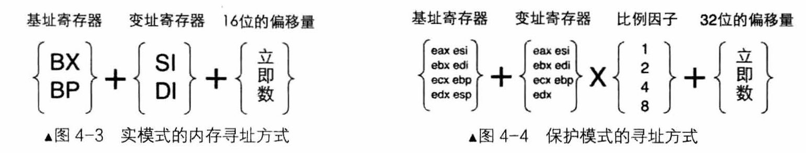

# 第四章

## 保护模式概述

实模式存在的问题

1. 实模式操作系统与用户程序处于同一特权级
2. 用户程序引用的地址都是真实物理地址
3. 用户程序可以随意修改段基址，可以访问所有内存
4. 访问超过64KB内存需要切换段基址
5. 一次只能运行一个程序
6. 共20条地址线，最大可用内存为1MB

地址转换需要CPU与OS相互配合，CPU在硬件提供地址转换部件，OS提供转换过程所需要的页表

32位CPU具有保护模式和实模式两种运行模式，可以兼容实模式下的程序

实模式下CPU运行环境16位，保护模式下CPU运行环境32位

## 初见保护模式

除了断寄存器，其他寄存器都拓展到了32位

保护模式的安全性，很大一部分体现在内存段的描述方面，“全局描述符表”存储了对内存段的描述信息（约束条件）

每一个表项成为段描述符，大小为64字节，**描述了各内存段的起始地址、大小、权限等信息**

全局描述附表很大，并且存在内存中，**GDTR寄存器**指向他

所以，段寄存器不保存段基址，保存内容为“**选择子**”，选择子是一个数，用来索引全局描述附表的段描述符，类似于数组中的下标

1. 段描述符存在内存，这对CPU来说太慢了
2. 段描述符，一个数据存在三个地方，整合数据也要花时间

所以，CPU对段寄存器应用了缓存技术（**段描述符缓冲寄存器**, Descriptor Cache Registers），CPU每次将内存段信息整理后，就存入段描述符缓冲寄存器，每次访问相同段就可以直接读缓存

段描述符缓冲寄存器也可用在实模式下

实模式与保护模式寻址方式对比

实模式下：
`BX`的段寄存器为`ds`，经常用于访问数据
`BP`的段寄存器为`ss`，经常用于访问栈

保护模式下：
基址寄存器为所有通用32为寄存器
变址寄存器为除了`esp`外所有的通用寄存器
